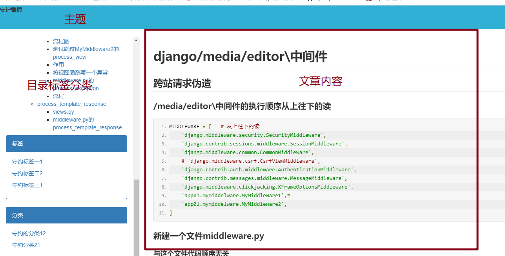

# 48.文章详情页

## 如果是文章

```python
http://127.0.0.1:8001/shouyue/article/某个文章
```

## 如果是随笔

```
http://127.0.0.1:8001/shouyue/p/某个随笔
```

## base.html

```html
<!DOCTYPE html>
<html lang="en">
<head>
    <meta charset="UTF-8">
    <title>{{ blog.userinfo.username }}-个人博客</title>
    <link rel="stylesheet" href="/static/bootstrap-3.3.7-dist/css/bootstrap.min.css">
{#    导入不同的博客样式#}
    <link rel="stylesheet" href="/static/css/{{ blog.theme }}">
    <script src="/static/jquery-3.3.1.js"></script>
    <style>
        * {
            margin: auto;
        }

    </style>
</head>


<body>

<div class="head">
    <p>{{ blog.title }}</p>
</div>

<div class="container-fluid">
    <div class="row">
        <div class="col-md-3">
            <div class="panel panel-primary">
                <div class="panel-heading">标签</div>
                <div class="panel-body">
                    
                        <p><a href="/{{ username }}/tag/{{ foo.2 }}">{{ foo.0 }}{{ foo.1 }}</a></p>
                    
                </div>
            </div>
            <div class="panel panel-primary">
                <div class="panel-heading">分类</div>
                <div class="panel-body">
                    
                        <p><a href="/{{ username }}/category/{{ foo.2 }}">{{ foo.0 }}{{ foo.1 }}</a></p>
                    
                </div>
            </div>
            <div class="panel panel-primary">
                <div class="panel-heading">随便档案</div>
                <div class="panel-body">
                    
                    <p><a href="/{{ username }}/archive/{{ foo.0|date:"Y年m月" }}">{{ foo.0|date:"Y年m月" }}({{ foo.1 }})</a></p>
                    


                </div>
            </div>
        </div>
        <div class="col-md-9">
            
            
            

        </div>
    </div>
</div>
</body>
</html>
```

## article_detail.html继承

```html




```

## 开始重新布局



## 把主题部分给载剪出来

```python
def user_blog(request,username,*args,**kwargs):
    print(username)
    username=username
    user = models.UserInfo.objects.filter(username=username).first()
    if not user:
        return render(request,'error.html')
    blog = user.blog
    print(kwargs)
    article_list=blog.article_set.all()
    # 取出condition中的分类/标签/时间
    condition = kwargs.get('condition')
    # condition 可能是category|tag|archive中的一个 可能是空
    # 取出param的值，可能为标签id，分类id，或者是时间
    param = kwargs.get('param')
    print(condition)
    print(param)
    if 'tag' == condition:
        article_list = article_list.filter(tag__pk=param)
    elif 'category' == condition:
        print(111)
        article_list = article_list.filter(category__pk = param)
    elif 'archive'==condition:
        archive_list = param.split('-')
        article_list=article_list.filter(create_time__year=archive_list[0],create_time__month=archive_list[1])
    elif condition != None:
        return render(request, 'error.html')
    print(article_list)
    # 每个的分类,对应的文章数
    # group by 谁，就以谁做基表
    # ret = models.Category.objects.all().annotate(count=Count('article__title')).values('title','count')
    # ret = models.Category.objects.all().filter(blog=blog).annotate(count=Count('article__title')).values('title','count')
    # category_num = models.Category.objects.all().filter(blog=blog).annotate(count=Count('article__title')).values('title','count')
    # category_num = models.Category.objects.all().filter(blog=blog).annotate(count=Count('article__title')).values_list('title','count','pk')
    #
    # print(category_num)
    # tag_num = models.Tag.objects.all().filter(blog=blog).annotate(count=Count('article__title')).values_list('title','count','pk')
    # print(tag_num)
    # from django.db.models.functions import TruncMonth
    # y_m_num = models.Article.objects.all().filter(blog=blog).annotate(y_m=TruncMonth('create_time')).values('y_m').annotate(
    #     count=Count('y_m')).values_list('y_m','count')
    # print(y_m_num)
    return render(request,'user_blog.html',locals())
```

## 注释的部分放到一个自定义过滤器里面

### 新建相应的文件夹和文件my_tag.py

#### 为了让classify.html使用

```python
from django.template import Library
register = Library()
from django.db.models.functions import TruncMonth
from blog import models
from django.db.models import Count
@register.inclusion_tag('classify.html')
def classify(username):
    username=username
    user = models.UserInfo.objects.filter(username=username).first()
    blog = user.blog
    category_num = models.Category.objects.all().filter(blog=blog).annotate(count=Count('article__title')).values_list(
        'title', 'count', 'pk')
    tag_num = models.Tag.objects.all().filter(blog=blog).annotate(count=Count('article__title')).values_list('title','count','pk')
    y_m_num = models.Article.objects.all().filter(blog=blog).annotate(y_m=TruncMonth('create_time')).values(
        'y_m').annotate(
        count=Count('y_m')).values_list('y_m', 'count')
    return {'category_num': category_num,'tag_num':tag_num,'y_m_num':y_m_num,'username':username}
```

### 当然也就是把base.html的col-md-3部分给载剪出来

#### base.html并且加入的markdown

```python
<!DOCTYPE html>
<html lang="en">
<head>
    <meta charset="UTF-8">
    <title>{{ blog.userinfo.username }}-个人博客</title>
    <link rel="stylesheet" href="/static/bootstrap-3.3.7-dist/css/bootstrap.min.css">
    {#    导入不同的博客样式#}
    <link rel="stylesheet" href="/static/css/{{ blog.theme }}">
    <script src="/static/jquery-3.3.1.js"></script>
    <style>
        * {
            margin: auto;
        }

        .col-md-3 {
            position: fixed;
            height: 100vh;
            overflow: scroll;
        }
        .col-md-9{
            position: absolute;
            left: 25%;
        }
    </style>
</head>


<body>

<div class="head">
    <p>{{ blog.title }}</p>
</div>

<div class="container-fluid">
    <div class="row">
        <div class="col-md-3">
                
                    <div class="widget widget-content">
                        <h3 class="widget-title">文章目录</h3>
                        <!-- 由于 toc 的值为一段 HTML 文本，所以要使用 safe 标签过滤 -->
                        {{ article.toc|safe }}
                    </div>
                
                
                
        </div>
        <div class="col-md-9">
            

            

        </div>
    </div>
</div>
</body>
</html>
```

#### classify.html

```python
<div>
     <div class="panel panel-primary">
                <div class="panel-heading">标签</div>
                <div class="panel-body">
                    
                        <p><a href="/{{ username }}/tag/{{ foo.2 }}">{{ foo.0 }}{{ foo.1 }}</a></p>
                    
                </div>
            </div>
            <div class="panel panel-primary">
                <div class="panel-heading">分类</div>
                <div class="panel-body">
                    
                        <p><a href="/{{ username }}/category/{{ foo.2 }}">{{ foo.0 }}{{ foo.1 }}</a></p>
                    
                </div>
            </div>
            <div class="panel panel-primary">
                <div class="panel-heading">随便档案</div>
                <div class="panel-body">
                    
                    <p><a href="/{{ username }}/archive/{{ foo.0|date:"Y-m" }}">{{ foo.0|date:"Y-m" }}({{ foo.1 }})</a></p>
                    


                </div>
            </div>
</div>
```

## article_detail视图函数

```python
import re

import markdown
from django.db.models import Count
from django.shortcuts import render, HttpResponse, redirect, get_object_or_404
from django.contrib.auth.models import AbstractUser
from django.contrib import auth
from django.http import JsonResponse
from PIL import Image, ImageDraw, ImageFont
from io import BytesIO
from  django.utils.text import slugify
from markdown.extensions.toc import TocExtension

from blog import myforms
from blog import models

def article_detail(request,username,id):

    print(username)
    username = username
    user = models.UserInfo.objects.filter(username=username).first()
    if not user:
        return render(request, 'error.html')
    blog = user.blog

    article=models.Article.objects.filter(pk=id).first()
    article = get_object_or_404(models.Article, pk=id)
    md = markdown.Markdown(extensions=[
        'markdown.extensions.extra',
        'markdown.extensions.codehilite',
        'markdown.extensions.toc',
        TocExtension(slugify=slugify),
    ])
    article.body = md.convert(article.content)

    article.toc = md.toc
    return render(request,'article_detail.html',locals())
```

## markdown补充

### app注册

```python
INSTALLED_APPS = [
    'mdeditor',]
```

### 路由

```python
url(r'mdeditor/', include('mdeditor.urls')),  # mdeditor路由
```

