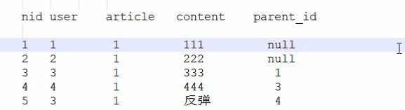
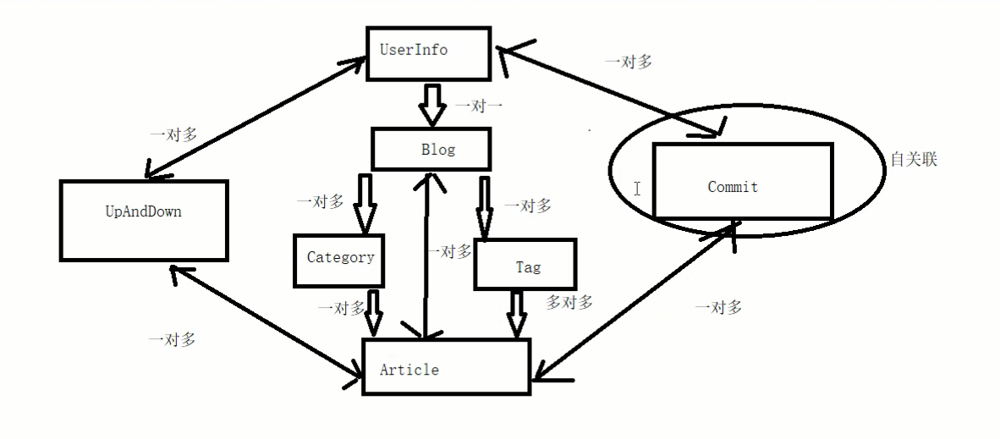
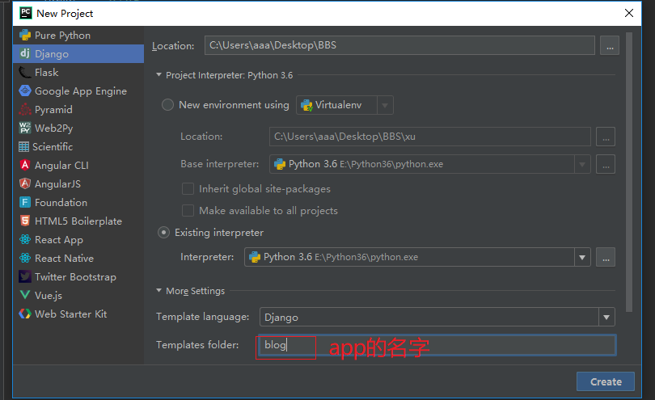
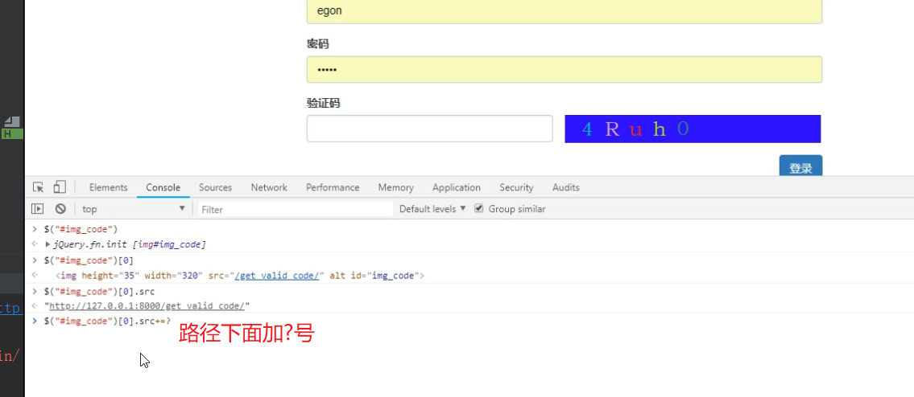
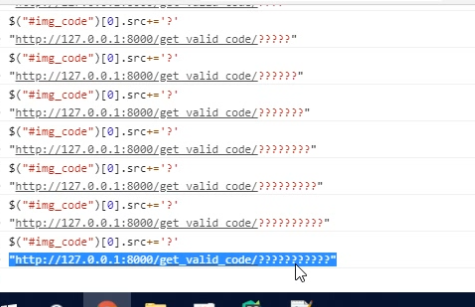

# BBS

## 1.-首页(显示文章)

​		-文章详情
		-点赞,点踩
		-文章评论
			-字评论
			-评论的展示
		-登录功能(图片验证码)
		-注册功能(基于form验证,ajax)
		-个人站点(不同人不同样式,文章过滤)
		-后台管理:
			-文章展示
		-新增文章
			-富文本编辑器

## 2.数据库设计:

### User:

```
-nid
-name
-password
-email
-phone
-avatar   用户头像
-create_date    用户注册时间
-blog
```

### Blog:

```
-nid
-title
-site_name(站点名称)
-theme
```

### Category:

```
-nid
-title
-blog   blog对category 一对多
-article category对article 一对多(字段写到多的一方article)
```

### Tag:(文章关键字)

```
-nid
-title
-blog blog对tag 一对多
```

### Article

```
-nid
-title
-desc(摘要)
-create_time   auto_add_now:当该条记录创建时,自动添加当前时间
-content   文章内容
-category   category对article 一对多
-tag Article对tag 多对多
-blog blog对Article 一对多
```

### Commit:

```
-nid
-user     哪个用户
-article  对哪篇文章
-content   评论了什么内容
-commit_time  时间
-parent_id -再加一个字段,标志,给那条评论,评论的(父评论的ID)
如何实现根评论与子评论? (@某个人)
-有同学分析,要再建一张表,跟commit是一对多的关系(不好)
				
   -如何用这一个表,表示出根评论和子评论?
   -再加一个字段,标志,给那条评论,评论的
```



# BBS项目表关系图



# BBS代码流程

# 一. 博客项目表字段编写,数据库迁移

## 1.创建BBS

## 2.连接mysql

```python
DATABASES = {
    # 'default': {
    #     'ENGINE': 'django.db.backends.sqlite3',
    #     'NAME': os.path.join(BASE_DIR, 'db.sqlite3'),
    # }
    'default': {
        'ENGINE': 'django.db.backends.mysql',
        'NAME': 'bbs1',
        'HOST': '127.0.0.1',
        'PORT': 3306,
        'USER': 'root',
        'PASSWORD': '123',
    }
}
```

## 3.设置启动项目启动pymysql

```python
注意BBS__init__.py和app的__init__.py不一样
import pymysql
pymysql.install_as_MySQLdb()
```

## 4.配置静态文件路径setting.py,

### 后面一定要加逗号(创建start文件)

```python
STATICFILES_DIRS = (
    os.path.join(BASE_DIR, 'static'),
)
```

## 五.models

## 5.导入auth主键

```python
from django.contrib.auth.models import AbstractUser
```

## 6.UserInfo这个表,继承AbstractUser,

### 因为要用auth组件(20,7,8)

```python
class UserInfo(AbstractUser):
    nid = models.AutoField(primary_key=True)
    20.默认为空,unique=True
    # username=models.CharField(max_length=32,unique=True)
    # 该字段可以为空,为该字段设置默认值,default='123455666'
    # blank=True  只是admin中表单提交的时候,做校验,如果设置成True,就是不校验了
    phone = models.CharField(max_length=32,null=True,blank=True)
    # upload_to需要传一个路径(avatar文件夹会自动创建)
    7.upload是上传的,default是默认的
    avatar = models.FileField(upload_to='avatar/', default='/static/img/default.png')
    8.关联表一对一
    # 如果avatar用charfield,如何处理?
    #  一对一关联blog表,to_field如果不写,默认主键
    # blog_id字段存的数据是什么?blog表的---nid这个字段
    blog = models.OneToOneField(to='Blog', to_field='nid',null=True)
```

## 7.upload是上传的,default是默认的

```python
avatar = models.FileField(upload_to='avatar/', default='/static/img/default.png')
```
## 9.创建站点表

```python
class Blog(models.Model):
    nid = models.AutoField(primary_key=True)
    title = models.CharField(max_length=64)
    10.站点名字
    site_name = models.CharField(max_length=32)
    11.站点主题
    theme = models.CharField(max_length=64)
```

## 10.创建分类表

```python
class Category(models.Model):
    nid = models.AutoField(primary_key=True)
    title = models.CharField(max_length=64)
    # ForeignKey跟OneToOneField的区别?
    #OneToOneField unique=True
    blog = models.ForeignKey(to='Blog', to_field='nid', null=True)
```

## 11.创建标签表

```python
class Tag(models.Model):
    nid = models.AutoField(primary_key=True)
    title = models.CharField(max_length=64)
    blog = models.ForeignKey(to='Blog', to_field='nid', null=True)
```

## 12.创建文章表(13)

```python
class Article(models.Model):
    nid = models.AutoField(primary_key=True)
    # verbose_name='文章标题'  修改admin中表单的文字显示
    title = models.CharField(max_length=64,verbose_name='文章标题')
    # 摘要,简单描述
    desc = models.CharField(max_length=255)
    # 大文本TextField()
    content = models.TextField()
    # 存时间类型,auto_now_add每插入一条数据,时间自动写入当前时间,
    # auto_now,这条数据修改的时候,会更新成当前时间
    create_time = models.DateTimeField(auto_now_add=True)

    # 因为查询多,写入少,所以加这三个字段,以后不需要再连表查询了
    commit_num=models.IntegerField(default=0)
    up_num=models.IntegerField(default=0)
    down_num=models.IntegerField(default=0)

    blog = models.ForeignKey(to='Blog', to_field='nid', null=True)
    12.一篇文章有多个分类
    category = models.ForeignKey(to='Category', to_field='nid', null=True)
    # through_fields应该怎么写?
    # 中介模型,手动创建第三张表,through是通过哪个表跟Tag建立关系,through_fields为了查询用的
    13.文章标签多对多参数的关系:to='Tag'(关联那张表,)through='ArticleTOTag'(关联的第三张表),through_fields=('article', 'tag')第一个参数的当前表
    tag = models.ManyToManyField(to='Tag', through='ArticleTOTag', through_fields=('article', 'tag'))
    # 这样写,会自动创建第三张表
    # tag = models.ManyToManyField(to='Tag')
```
## 14.和13联系手动创建第三张表

```python
class ArticleTOTag(models.Model):
    nid = models.AutoField(primary_key=True)
    article = models.ForeignKey(to='Article', to_field='nid')
    tag = models.ForeignKey(to='Tag', to_field='nid')
    # article和tag应不应该联合唯一?
```

## 15.创建评论表(16.自关联)

```python
class Commit(models.Model):
    nid = models.AutoField(primary_key=True)
    user = models.ForeignKey(to='UserInfo', to_field='nid')
    article = models.ForeignKey(to='Article', to_field='nid')
    content = models.CharField(max_length=255)
    create_time = models.DateTimeField(auto_now_add=True)
    # 这样写是可以的
    # parent_id=models.IntegerField()
    16.自关联
    # parent_id=models.ForeignKey(to='Commit',to_field='nid')
    parent = models.ForeignKey(to='self', to_field='nid',null=True,blank=True)
```

## 17.创建点赞表

```python
class UpAndDown(models.Model):
    nid = models.AutoField(primary_key=True)
    18.用户不对文章点多个赞,不写脏数据,一个赞对多个用户,一个赞对多个文章
    user = models.ForeignKey(to='UserInfo', to_field='nid')
    article = models.ForeignKey(to='Article', to_field='nid')
    is_up = models.BooleanField()

    class Meta:
        19.写这些,只是为了不写脏数据,联合唯一
        unique_together = (('user', 'article'),)
```

## 21.数据库迁移在setting.py

```python
AUTH_USER_MODEL = 'blog.UserInfo'
```

## 22.执行pycharm的Tools

# 2.生成图片验证码

## 23.创建登陆页面

```python
在urls.py
from blog import views
url(r'^login/', views.login),
在temlates文件夹
templates/login.html
```

## 23.引入bootstrap和jquery

```html
<link rel="stylesheet" href="/static/bootstrap-3.3.7-dist/css/bootstrap.min.css">
<script src="/static/jquery-3.3.1.js"></script>
```

## 24.将栅格系统,将内容放入中见

```html
<div class="container-fluid">
    <div class="row">
        <div class="col-md-6 col-md-offset-3">
```

## 25.使用bootstrap语法(26.27.28)

```html
<h1>登录</h1>
            26.{# label for="name"  如果指定某个id,这样点击这个label,焦点会到对应的控件上         #}
            <form>
                
                <div class="form-group">
                    <label for="name">用户名</label>
                    <input type="text" id="name" class="form-control">
                </div>
                <div class="form-group">
                    <label for="pwd">密码</label>
                    <input type="password" id="pwd" class="form-control">
                </div>
                <div class="form-group">
                    <label for="valid_code">验证码</label>
                    27.预留出验证码一半的位置
                    <div class="row">
                        <div class="col-md-6">
                            <input type="text" id="valid_code" class="form-control">
                        </div>
                        28.添加一个本地的路由
                        
                    </div>

                </div>	

                <input type="button" value="登录" class="btn btn-primary " id="btn"><span class="error"></span>
            </form>
```

## 添加一张本地图片

```
def get_valid_code(request):
    # 第一种方式
    # with open('static/img/lhf.jpg','rb') as f:
    #     # 图片二进制
    #     data=f.read()
    # return HttpResponse(data)
```

## 29.导入pillow模块PIL简写

```python
from PIL import Image, ImageDraw, ImageFont
```
## 30.# 生成一张图片,

### 第一个参数是模式:RGB,

### 第二个参数是图片大小,

### 第三个参数是图片颜色

```python
# pip3 install Pillow
    # pillow 是一个图形处理的模块,功能很强强大
    # 生成一张图片,第一个参数是模式:RGB,第二个参数是图片大小,第三个参数是图片颜色
    31.调用一个函数,里面生成随机的颜色码
    # img = Image.new('RGB', (320, 35), color=get_random_color())
    # # 保存到本地
    # with open('valid_code.png', 'wb') as f:
    #     # 直接用img的save方法,第一个参数是空文件,第二个参数图片格式
    #     img.save(f, 'png')
    # # 打开文件,再返回
    # with open('valid_code.png', 'rb') as f:
    #     data = f.read()
    # return HttpResponse(data)
```

## 32.创建31调用的函数

```python
import random
def get_random_color():
    return (
        random.randint(0, 255), random.randint(0, 255), random.randint(0, 255)
    )
```

## 32.内存关联图片BytesIO模块

```python
# 第三种方式
   # 在内存中生成一个空文件(把它想象成 open('valid_code.png', 'wb') as f:)
   # 一个是在硬盘上,一个是在内存中
   # img = Image.new('RGB', (320, 35), color=get_random_color())
   # f = BytesIO()
   # # 把图片保存到f中
   # # 放到内存中,存取比较快,而且有自动清理
   # img.save(f, 'png')
   #
   # data = f.getvalue()
   # return HttpResponse(data)
```

## 33.# ForeignKey跟OneToOneField的区别?

```python
#OneToOneField unique=True,还有联合唯一
```

## 34.# 存时间类型,

###### auto_now_add每插入一条数据,时间自动写入当前时间,

```python
# auto_now,这条数据修改的时候,会更新成当前时间
create_time = models.DateTimeField(auto_now_add=True)
```

## 35.# 中介模型,

```
手动创建第三张表,

through是通过哪个表跟Tag建立关系,

through_fields为了查询用的(36)
```

## 36.# article和tag应不应该联合唯一?一般不键,因为多对多

```python
tag = models.ManyToManyField(to='Tag', through='ArticleTOTag', through_fields=('article', 'tag'))
    # 这样写,会自动创建第三张表
    # tag = models.ManyToManyField(to='Tag')
# 手动创建第三张表
class ArticleTOTag(models.Model):
    nid = models.AutoField(primary_key=True)
    article = models.ForeignKey(to='Article', to_field='nid')
    tag = models.ForeignKey(to='Tag', to_field='nid')
    36.# article和tag应不应该联合唯一?一般不键,因为多对多
```

## 37.# 自关联(子评论)

```python
# parent_id=models.ForeignKey(to='Commit',to_field='nid')
parent = models.ForeignKey(to='self', to_field='nid',null=True,blank=True)
```

## 38.# 第四种方式,在图片上写文字

```python
# img = Image.new('RGB', (320, 35), color=get_random_color())
# # 拿到画笔,把图片传入画笔
# img_draw=ImageDraw.Draw(img)
# # 生成一个字体对象,第一个参数是字体文件的路径,第二个参数是字体大小
# font=ImageFont.truetype('static/font/ss.TTF',size=25)
#
# # 第一个参数,xy的坐标,第二个参数:要写的文字,第三个参数:写文字的颜色,第四个参数:字体
# # 不同的字体是不同的ttf文件
# img_draw.text((0,0),'python',get_random_color(),font=font)
#
# f = BytesIO()
# # 把图片保存到f中
# # 放到内存中,存取比较快,而且有自动清理
# img.save(f, 'png')
#
# data = f.getvalue()
```

## 39.# 不同的字体是不同的ttf文件

```python
random_code = ''
# 弄一个循环,循环5次,每次随机写一个(数字,大写,小写字母)
for i in range(5):
    char_num = random.randint(0, 9)
    # 生成一个97到122的数字,然后用chr转成字符
    char_lower = chr(random.randint(97, 122))
    char_upper = chr(random.randint(65, 90))
    char_str = str(random.choice([char_num, char_lower, char_upper]))
    img_draw.text((i * 30 + 20, 0), char_str, get_random_color(), font=font)

    random_code += char_str
# 把验证码保存到session中
print(random_code)
request.session['valid_code'] = random_code
'''
1 生成一个随机字符串:ddddsfassda
2 在session表中插入一条数据
3 在cook中写入 :sessionid=ddddsfassda
'''
```

## 40.画原画点

```python
# width = 320
# height = 35
# for i in range(10):
#     x1 = random.randint(0, width)
#     x2 = random.randint(0, width)
#     y1 = random.randint(0, height)
#     y2 = random.randint(0, height)
#     # 在图片上画线
#     img_draw.line((x1, y1, x2, y2), fill=get_random_color())
#
# for i in range(100):
#     # 画点
#     img_draw.point([random.randint(0, width), random.randint(0, height)], fill=get_random_color())
#     x = random.randint(0, width)
#     y = random.randint(0, height)
#     # 画弧形
#     img_draw.arc((x, y, x + 4, y + 4), 0, 90, fill=get_random_color())
```

## 41.验证码点击事件





```html
login.html文件中加入id="img_code"

<script>
    $("#img_code").click(function () {
        //在路径后面加一个问号
        //$("#img_code")[0].src+='?'0是清晰度最低的
        // alert(11)
```

## 42.保存到随机session(打开2个网站其中一个是失效的)

```python
# 不同的字体是不同的ttf文件
    random_code = ''
    # 弄一个循环,循环5次,每次随机写一个(数字,大写,小写字母)
    for i in range(5):
        char_num = random.randint(0, 9)
        # 生成一个97到122的数字,然后用chr转成字符
        char_lower = chr(random.randint(97, 122))
        char_upper = chr(random.randint(65, 90))
        char_str = str(random.choice([char_num, char_lower, char_upper]))
        img_draw.text((i * 30 + 20, 0), char_str, get_random_color(), font=font)

        random_code += char_str
    # 把验证码保存到session中
    print(random_code)
    request.session['valid_code'] = random_code
    '''
    1 生成一个随机字符串:ddddsfassda
    2 在session表中插入一条数据
    3 在cook中写入 :sessionid=ddddsfassda
    '''
```
## 43.登陆视图函数

ajax请求,不能再返回render页面,或者redirect,只能返回字符串

```python
from django.contrib.auth.models import AbstractUser
from django.contrib import auth
from django.http import JsonResponse
def login(request):
    if request.method == 'GET':
        dic = {'name': 'lqz', 'age': 18}
        return render(request, 'login.html', locals())
    # elif request.method=='POST':
    44.# 判断前台发的请求是不是ajax的请求
    elif request.is_ajax():
        response = {'user': None, 'msg': None}
        name = request.POST.get('name')
        pwd = request.POST.get('pwd')
        valid_code = request.POST.get('valid_code')
        45.# 判断传过来的验证码是否正确
        # 从session中取出来
        if valid_code.upper() == request.session.get('valid_code').upper():
            46.导入auth模块
            user = auth.authenticate(request, username=name, password=pwd)
            if user:
                # ajax请求,不能再返回render页面,或者redirect,只能返回字符串
                # 校验通过,一定要登录
                auth.login(request, user)
                response['user'] = name
                response['msg'] = '登录成功'
            else:
                # 用户名密码错误
                response['msg'] = '用户名密码错误'
        else:
            response['msg'] = '验证码错误'
    return JsonResponse(response)
```
