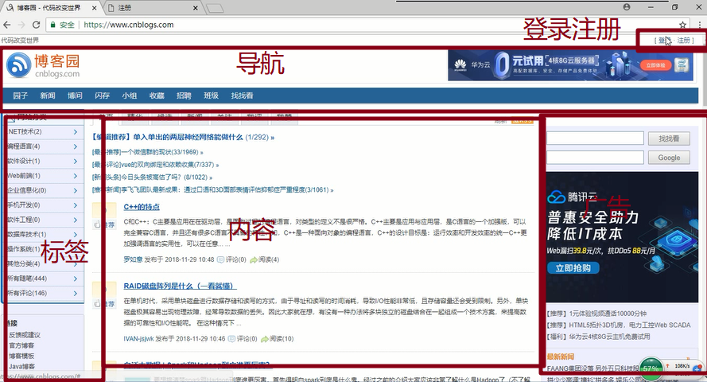
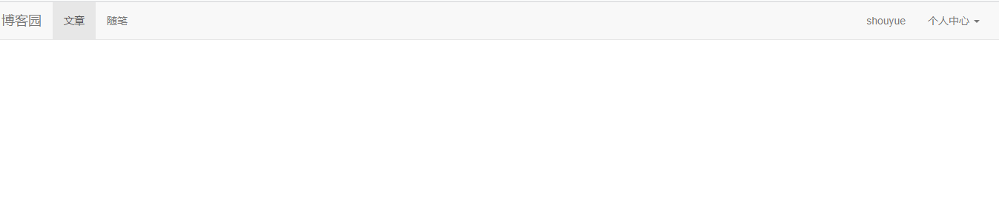
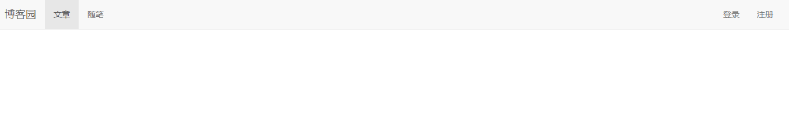
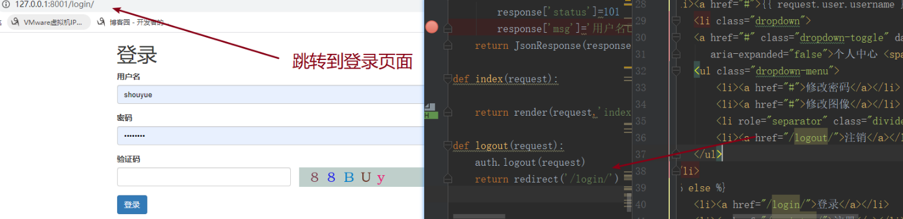
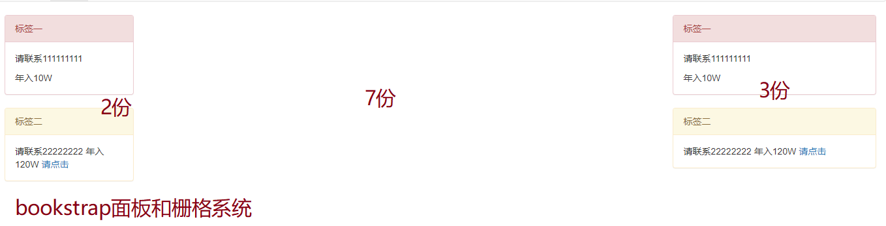
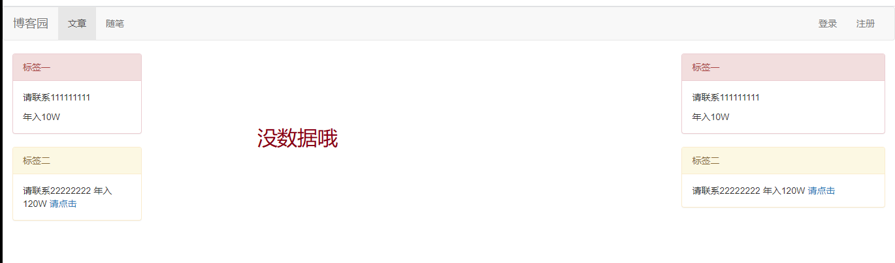

# 46.index主页面



## 1.index页面html

```html
<!DOCTYPE html>
<html lang="en">
<head>
    <meta charset="UTF-8">
    //1.引用了bootstrap.min.css，jquery-3.3.1.js，bootstrap.js
    <link rel="stylesheet" href="/static/bootstrap-3.3.7-dist/css/bootstrap.min.css">
    <script src="/static/jquery-3.3.1.js"></script>
    <script src="/static/bootstrap-3.3.7-dist/js/bootstrap.js"></script>
    <title>博客园</title>
</head>
<body>
<div class="head">
    <nav class="navbar navbar-default">
        <div class="container-fluid">
            <!-- Brand and toggle get grouped for better mobile display -->
            <div class="navbar-header">
				
                <a class="navbar-brand" href="#">博客园</a>
            </div>

            <!-- Collect the nav links, forms, and other content for toggling -->
            <div class="collapse navbar-collapse" id="bs-example-navbar-collapse-1">
                <ul class="nav navbar-nav">
                    <li class="active"><a href="#">文章 <span class="sr-only">(current)</span></a></li>
                    <li><a href="#">随笔</a></li>
                </ul>
                <ul class="nav navbar-nav navbar-right">
                    //2.验证一下用户是否登录
                    
                    //3.登录成功的页面
                    <li><a href="#">{{ request.user.username }}</a></li>
                        <li class="dropdown">
                        <a href="#" class="dropdown-toggle" data-toggle="dropdown" role="button" aria-haspopup="true"
                           aria-expanded="false">个人中心 <span class="caret"></span></a>
                        <ul class="dropdown-menu">
                            <li><a href="#">修改密码</a></li>
                            <li><a href="#">修改图像</a></li>
                            <li role="separator" class="divider"></li>
                            <li><a href="/logout/">注销</a></li>
                        </ul>
                    </li>
                    
                    //注销后的效果
                        <li><a href="/login/">登录</a></li>
                        <li><a href="/register/">注册</a></li>
                    


                </ul>
            </div><!-- /.navbar-collapse -->
        </div><!-- /.container-fluid -->
    </nav>


</div>

<div class="container-fluid">
    <div class="row">
        <div class="col-md-2"></div>
        <div class="col-md-7"></div>
        <div class="col-md-3"></div>
    </div>
</div>
</body>
</html>
```

### 1.index页面html登录成功的效果



### 1.index页面未登录的效果图



### 1.index页面注销后的效果图



## 2.视图函数index和logout

```python
def index(request):
    return render(request,'index.html')

def logout(request):
    auth.logout(request)
    return redirect('/login/')
```

## 3.别忘记路由哦

```python
url(r'^index/', views.index),
url(r'^logout/', views.logout),
```

## 4.左侧和右侧放广告面板



### 代码

```html
<!DOCTYPE html>
<html lang="en">
<head>
    <meta charset="UTF-8">
    <link rel="stylesheet" href="/static/bootstrap-3.3.7-dist/css/bootstrap.min.css">
    <script src="/static/jquery-3.3.1.js"></script>
    <script src="/static/bootstrap-3.3.7-dist/js/bootstrap.js"></script>
    <title>博客园</title>
</head>
<body>
<div class="head">
    <nav class="navbar navbar-default">
        <div class="container-fluid">
            <!-- Brand and toggle get grouped for better mobile display -->
            <div class="navbar-header">

                <a class="navbar-brand" href="#">博客园</a>
            </div>

            <!-- Collect the nav links, forms, and other content for toggling -->
            <div class="collapse navbar-collapse" id="bs-example-navbar-collapse-1">
                <ul class="nav navbar-nav">
                    <li class="active"><a href="#">文章 <span class="sr-only">(current)</span></a></li>
                    <li><a href="#">随笔</a></li>
                </ul>
                <ul class="nav navbar-nav navbar-right">
                    
                        <li><a href="#">{{ request.user.username }}</a></li>
                        <li class="dropdown">
                            <a href="#" class="dropdown-toggle" data-toggle="dropdown" role="button"
                               aria-haspopup="true"
                               aria-expanded="false">个人中心 <span class="caret"></span></a>
                            <ul class="dropdown-menu">
                                <li><a href="#">修改密码</a></li>
                                <li><a href="#">修改图像</a></li>
                                <li role="separator" class="divider"></li>
                                <li><a href="/logout/">注销</a></li>
                            </ul>
                        </li>
                    
                        <li><a href="/login/">登录</a></li>
                        <li><a href="/register/">注册</a></li>
                    


                </ul>
            </div><!-- /.navbar-collapse -->
        </div><!-- /.container-fluid -->
    </nav>


</div>

<div class="container-fluid">
    <div class="row">
        <div class="col-md-2">
            <div class="panel panel-danger">
                <div class="panel-heading">标签一</div>
                <div class="panel-body">
                    <p>请联系111111111</p>
                    年入10W
                </div>
            </div>
            <div class="panel panel-warning">
                <div class="panel-heading">标签二</div>
                <div class="panel-body">
                    请联系22222222
                    年入120W
                    <a href="www.baidu.com">请点击</a>
                </div>
            </div>


        </div>
        <div class="col-md-7"></div>
        <div class="col-md-3">
            <div class="panel panel-danger">
                <div class="panel-heading">标签一</div>
                <div class="panel-body">
                    <p>请联系111111111</p>
                    年入10W
                </div>
            </div>
            <div class="panel panel-warning">
                <div class="panel-heading">标签二</div>
                <div class="panel-body">
                    请联系22222222
                    年入120W
                    <a href="www.baidu.com">请点击</a>
                </div>
            </div>
        </div>
    </div>
</div>
</body>
</html>
```

## 5.中间部分bookstrap媒体对象

```python
<div class="col-md-7">
            
                <div>
                    <h3><a href="">{{ article.title }}</a></h3>
                    //媒体对象
                    <div class="media">
                        <div class="media-left">
                            <a href="#">
                                
                            </a>
                        </div>
                        <div class="media-body">
                            //文章内容
                            {{ article.desc }}
                        </div>
                    </div>
                </div>
            


        </div>
```



## 6.利用后台管理添加数据

### 把models.py优化class Meta:

```python
from django.db import models
from django.contrib.auth.models import AbstractUser


# Create your models here.
# UserInfo 这个表 ，继承AbstractUser,因为要用auth
#
class UserInfo(AbstractUser):
    nid = models.AutoField(primary_key=True)
    # 20.默认为空,unique=True
    # username=models.CharField(max_length=32,unique=True)
    # 该字段可以为空,为该字段设置默认值,default='123455666'
    # blank=True  只是admin中表单提交的时候,做校验,如果设置成True,就是不校验了
    phone = models.CharField(max_length=32, null=True, blank=True)
    # upload_to需要传一个路径(avatar文件夹会自动创建)
    # 7.upload是上传的,default是默认的
    avatar = models.FileField(upload_to='avatar/', default='/avatar/default.png')
    # 8.关联表一对一
    # 如果avatar用charfield,如何处理?
    #  一对一关联blog表,to_field如果不写,默认主键
    # blog_id字段存的数据是什么?blog表的---nid这个字段
    blog = models.OneToOneField(to='Blog', to_field='nid', null=True)
    class Meta:
        # admin显示中文表名
        verbose_name='用户表'
        # verbose_name_plural这个是admin后台真正显示的表名 可以去掉s
        verbose_name_plural=verbose_name
    def __str__(self):
        return '用户%s'%self.nid
class Blog(models.Model):
    nid = models.AutoField(primary_key=True)
    title = models.CharField(max_length=64,verbose_name='站点标题')
    # 10.站点名字
    site_name = models.CharField(max_length=32,verbose_name='站点名字')
    # 11.站点主题
    theme = models.CharField(max_length=64,verbose_name='站点主题')
    class Meta:
        # admin显示中文表名
        verbose_name='站点表'
        # verbose_name_plural这个是admin后台真正显示的表名 可以去掉s
        verbose_name_plural=verbose_name
    def __str__(self):
        return self.site_name

class Category(models.Model):
    nid = models.AutoField(primary_key=True)
    title = models.CharField(max_length=64,verbose_name='分类标题')
    # ForeignKey跟OneToOneField的区别?
    # OneToOneField unique=True
    blog = models.ForeignKey(to='Blog', to_field='nid', null=True,verbose_name='分类多对一站点')
    class Meta:
        # admin显示中文表名
        verbose_name='分类'
        # verbose_name_plural这个是admin后台真正显示的表名 可以去掉s
        verbose_name_plural=verbose_name
    def __str__(self):
        return self.title
class Tag(models.Model):
    nid = models.AutoField(primary_key=True)
    title = models.CharField(max_length=64)
    blog = models.ForeignKey(to='Blog', to_field='nid', null=True,verbose_name='标签多对一站点')
    class Meta:
        # admin显示中文表名
        verbose_name='标签表'
        # verbose_name_plural这个是admin后台真正显示的表名 可以去掉s
        verbose_name_plural=verbose_name
    def __str__(self):
        return self.title

class Article(models.Model):
    nid = models.AutoField(primary_key=True)
    # verbose_name='文章标题'  修改admin中表单的文字显示
    title = models.CharField(max_length=64, verbose_name='文章标题')
    # 摘要,简单描述
    desc = models.CharField(max_length=255, verbose_name='文章摘要')
    # 大文本TextField()
    content = models.TextField(verbose_name='文章内容')
    # 存时间类型,auto_now_add每插入一条数据,时间自动写入当前时间,
    # auto_now,这条数据修改的时候,会更新成当前时间
    create_time = models.DateTimeField(auto_now_add=True,verbose_name='文章更新时间')
    # 因为查询多,写入少,所以加这三个字段,以后不需要再连表查询了
    commit_num = models.IntegerField(default=0,verbose_name='文章评论数')
    up_num = models.IntegerField(default=0,verbose_name='文章点赞数')
    down_num = models.IntegerField(default=0,verbose_name='文章点踩数')
    blog = models.ForeignKey(to='Blog', to_field='nid', null=True,verbose_name='文章多对一站点')
    # 12.一篇文章有多个分类
    category = models.ForeignKey(to='Category', to_field='nid', null=True,verbose_name='文章多对一分类')
    # through_fields应该怎么写?
    # 中介模型,手动创建第三张表,through是通过哪个表跟Tag建立关系,through_fields为了查询用的
    # 13.文章标签多对多参数的关系:to='Tag'(关联那张表,)through='ArticleTOTag'(关联的第三张表),through_fields=('article', 'tag')第一个参数的当前表
    tag = models.ManyToManyField(to='Tag', through='ArticleTOTag', through_fields=('article', 'tag'),verbose_name='文章多对多标签')
    # 这样写,会自动创建第三张表
    # tag = models.ManyToManyField(to='Tag')
    class Meta:
        # admin显示中文表名
        verbose_name='文章表'
        # verbose_name_plural这个是admin后台真正显示的表名 可以去掉s
        verbose_name_plural=verbose_name
    def __str__(self):
        return self.title+"----"+self.blog.userinfo.username

class ArticleTOTag(models.Model):
    nid = models.AutoField(primary_key=True)
    article = models.ForeignKey(to='Article', to_field='nid',verbose_name='文章to标签article字段')
    tag = models.ForeignKey(to='Tag', to_field='nid',verbose_name='文章to标签tag字段')
    # article和tag应不应该联合唯一?
    # 理论上也应该需要
    class Meta:
        # admin显示中文表名
        verbose_name='文章多对多标签'
        # verbose_name_plural这个是admin后台真正显示的表名 可以去掉s
        verbose_name_plural=verbose_name
        unique_together = (('article', 'tag'),)
    def __str__(self):
        return str(self.nid)
class Commit(models.Model):
    nid = models.AutoField(primary_key=True)
    user = models.ForeignKey(to='UserInfo', to_field='nid',verbose_name='那个用户评论')
    article = models.ForeignKey(to='Article', to_field='nid',verbose_name='那个文章被评论')
    content = models.CharField(max_length=255,verbose_name='评论内容')
    create_time = models.DateTimeField(auto_now_add=True,verbose_name='评论更新时间')
    # 这样写是可以的，但是没发跨表查询
    # parent_id=models.IntegerField()
    # 16.自关联
    # parent_id=models.ForeignKey(to='Commit',to_field='nid')
    parent = models.ForeignKey(to='self', to_field='nid',null=True,blank=True,verbose_name='那个人评论了该用户的评论')
    class Meta:
        # admin显示中文表名
        verbose_name='评论表'
        # verbose_name_plural这个是admin后台真正显示的表名 可以去掉s
        verbose_name_plural=verbose_name
    def __str__(self):
        return '%s评论了%s'%(self.user,self.user)
class UpAndDown(models.Model):
    nid = models.AutoField(primary_key=True)
    # 18.用户不对文章点多个赞,不写脏数据,一个赞对多个用户,一个赞对多个文章
    user = models.ForeignKey(to='UserInfo', to_field='nid',verbose_name='那个用户点赞或点踩')
    article = models.ForeignKey(to='Article', to_field='nid',verbose_name='点赞或点踩的文章')
    is_up = models.BooleanField(verbose_name='点赞还是点踩')
    class Meta:
        # admin显示中文表名
        verbose_name = '点赞点踩表'
        # verbose_name_plural这个是admin后台真正显示的表名 可以去掉s
        verbose_name_plural = verbose_name
        # 19.写这些,只是为了不写脏数据,联合唯一
        unique_together = (('user', 'article'),)
    def __str__(self):
        return '%s%s%s'%(self.user,self.is_up,self.article)
```

## 7.index添加评论和点赞

```html
<div class="col-md-7">
            
                <div>
                    <h3><a href="">{{ article.title }}</a></h3>
{#                    //媒体对象#}
                    <div class="media">
                        <div class="media-left">
                            <a href="#">
{#                                #}
                                
                            </a>
                        </div>
                        <div class="media-body">
{#                            //文章内容#}
                            {{ article.desc }}
                        </div>
                    </div>
                    <div style="margin-top: 10px" class="article_bottom">
                        <span> <a href="">{{ article.blog.userinfo.username }}</a></span>
                        <span> <a href="">{{ article.create_time|date:'Y-m-d H:i:s' }}</a></span>
{#                        <span class="glyphicon glyphicon-comment"> <a href="">评论({{ article.commit_set.count }})</a></span>#}
                        <span class="glyphicon glyphicon-comment"> <a href="">评论({{ article.commit_num }})</a></span>
{#                        <span class="glyphicon glyphicon-thumbs-up"><a href="">点赞({{ article.upanddown_set.count }})</a></span>#}
                        <span class="glyphicon glyphicon-thumbs-up"><a href="">点赞({{ article.up_num }})</a></span>
                    </div>
                </div>
            


        </div>
```

