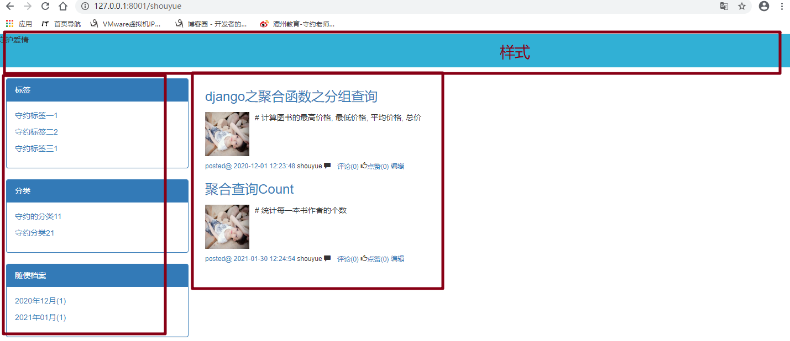
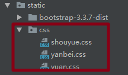

# 47.个人站点user_blog.html



## 1.路由

思路username/category或tag或archive/id

```python
url(r'^(?P<username>[\w]+)/(?P<condition>category|tag|archive)/(?P<param>.*)',views.user_blog),   # 放到最后
    url(r'^(?P<username>[\w]+)/(?P<condition>category|tag|archive|[\w]+)',views.user_blog),   # 放到最后
    url(r'^(?P<username>[\w]+)',views.user_blog),
```

## 2.视图函数

```python
def logout(request):
    auth.logout(request)
    return redirect('/login/')


def user_blog(request,username,*args,**kwargs):
    print(username)
    username=username
    user = models.UserInfo.objects.filter(username=username).first()
    if not user:
        return render(request,'error.html')

    blog = user.blog
    print(kwargs)
    article_list=blog.article_set.all()
    # 取出condition中的分类/标签/时间
    condition = kwargs.get('condition')
    # condition 可能是category|tag|archive中的一个 可能是空
    # 取出param的值，可能为标签id，分类id，或者是时间
    param = kwargs.get('param')
    print(condition)
    print(param)
    if 'tag' == condition:
        article_list = article_list.filter(tag__pk=param)
    elif 'category' == condition:
        print(111)
        article_list = article_list.filter(category__pk = param)
    elif 'archive'==condition:
        archive_list = param.split('-')
        article_list=article_list.filter(create_time__year=article_list[0],create_time__month=article_list[1])
    elif condition != None:
        return render(request, 'error.html')

    print(article_list)


    # 每个的分类,对应的文章数
    # group by 谁，就以谁做基表
    # ret = models.Category.objects.all().annotate(count=Count('article__title')).values('title','count')
    # ret = models.Category.objects.all().filter(blog=blog).annotate(count=Count('article__title')).values('title','count')
    # category_num = models.Category.objects.all().filter(blog=blog).annotate(count=Count('article__title')).values('title','count')
    category_num = models.Category.objects.all().filter(blog=blog).annotate(count=Count('article__title')).values_list('title','count','pk')

    print(category_num)
    tag_num = models.Tag.objects.all().filter(blog=blog).annotate(count=Count('article__title')).values_list('title','count','pk')
    print(tag_num)
    from django.db.models.functions import TruncMonth
    y_m_num = models.Article.objects.all().filter(blog=blog).annotate(y_m=TruncMonth('create_time')).values('y_m').annotate(
        count=Count('y_m')).values_list('y_m','count')
    print(y_m_num)
    return render(request,'user_blog.html',locals())
```

## 3.个人博客不同的样式



## 4.user_blog

```html
<!DOCTYPE html>
<html lang="en">
<head>
    <meta charset="UTF-8">
    <title>{{ blog.userinfo.username }}-个人博客</title>
    <link rel="stylesheet" href="/static/bootstrap-3.3.7-dist/css/bootstrap.min.css">
    {#    导入不同的博客样式#}
    <link rel="stylesheet" href="/static/css/{{ blog.theme }}">
    <script src="/static/jquery-3.3.1.js"></script>
    <style>
        * {
            margin: auto;
        }

    </style>
</head>


<body>

<div class="head">
    <p>{{ blog.title }}</p>
</div>

<div class="container-fluid">
    <div class="row">
        <div class="col-md-3">
            <div class="panel panel-primary">
                <div class="panel-heading">标签</div>
                <div class="panel-body">
                    
                        <p><a href="/{{ username }}/tag/{{ foo.2 }}">{{ foo.0 }}{{ foo.1 }}</a></p>
                    
                </div>
            </div>
            <div class="panel panel-primary">
                <div class="panel-heading">分类</div>
                <div class="panel-body">
                    
                        <p><a href="/{{ username }}/category/{{ foo.2 }}">{{ foo.0 }}{{ foo.1 }}</a></p>
                    

                </div>
            </div>
            <div class="panel panel-primary">
                <div class="panel-heading">随便档案</div>
                <div class="panel-body">
                    
                    <p><a href="/{{ username }}/archive/{{ foo.0|date:"Y年m月" }}">{{ foo.0|date:"Y年m月" }}({{ foo.1 }})</a></p>
                    
                    

                </div>
            </div>
        </div>
        <div class="col-md-9">
            {#            通过站点查询所有文章,反向查询,按表名小写_set.all#}
            
                <div>
                    <h3><a href="">{{ article.title }}</a></h3>
                    {#                    //媒体对象#}
                    <div class="media">
                        <div class="media-left">
                            <a href="#">
                                {#                                #}
                                
                            </a>
                        </div>
                        <div class="media-body">
                            {#                            //文章内容#}
                            {{ article.desc }}
                        </div>
                    </div>
                    <div style="margin-top: 10px" class="article_bottom small">

                        <span> <a href="">posted@ {{ article.create_time|date:'Y-m-d H:i:s' }}</a></span>
                        {#                                                <span class="glyphicon glyphicon-comment"> <a href="">评论({{ article.commit_set.count }})</a></span>#}
                        <span>{{ article.blog.userinfo.username }}</span>
                        <span class="glyphicon glyphicon-comment" aria-hidden="true"> <a
                                href="">评论({{ article.commit_num }})</a></span>
                        {#                        <span class="glyphicon glyphicon-thumbs-up"><a href="">点赞({{ article.upanddown_set.count }})</a></span>#}
                        <span class="glyphicon glyphicon-thumbs-up"><a href="">点赞({{ article.up_num }})</a></span>
                        <a href="">编辑</a>
                    </div>
                </div>
            

        </div>
    </div>
</div>
</body>
</html>
```

