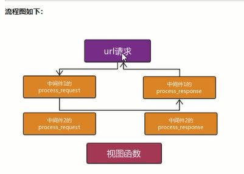
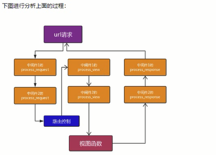
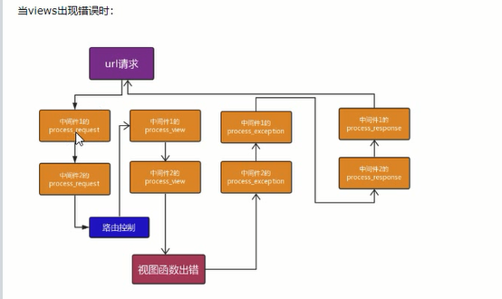

# django中间件

## 跨站请求伪造

### 中间件的执行顺序从上往下的读

```python
MIDDLEWARE = [   # 从上往下的读
    'django.middleware.security.SecurityMiddleware',
    'django.contrib.sessions.middleware.SessionMiddleware',
    'django.middleware.common.CommonMiddleware',
    # 'django.middleware.csrf.CsrfViewMiddleware',
    'django.contrib.auth.middleware.AuthenticationMiddleware',
    'django.contrib.messages.middleware.MessageMiddleware',
    'django.middleware.clickjacking.XFrameOptionsMiddleware',
    'app01.mymiddelware.MyMiddleware1',# 
    'app01.mymiddelware.MyMiddleware2',
]
```

### 新建一个文件middleware.py

#### 与这个文件代码顺序无关

```python
from django.utils.deprecation import MiddlewareMixin

class MyMiddleware2(MiddlewareMixin):
    def process_request(self,request):
        print('MyMiddleware--------2------->')

class MyMiddleware1(MiddlewareMixin):
    def process_request(self,request):
        print('MyMiddleware--------1------->')
```

## process_request  执行顺序从上往下

请求来的时候,会响应它

```
http://127.0.0.1:8000/test_middle/?name=shouyue 
输入这个网站 用GET提取shouyue
```

```python
from django.utils.deprecation import MiddlewareMixin

class MyMiddleware2(MiddlewareMixin):
    def process_request(self,request):
        print(request.GET.get('name'))
        print('MyMiddleware--------2------->')

class MyMiddleware1(MiddlewareMixin):
    def process_request(self,request):
        print('MyMiddleware--------1------->')
```

## process_response 执行顺序从下往上

响应回去的时候,会走它

### 错误示范

```python
from django.utils.deprecation import MiddlewareMixin
class MyMiddleware2(MiddlewareMixin):
    def process_request(self,request):
        print('MyMiddleware--------request2------->')
    def process_response(self,request,response):
        print('MyMiddleware--------response2------->')
class MyMiddleware1(MiddlewareMixin):
    def process_request(self,request):
        print('MyMiddleware--------request1------->')
    def process_response(self, request, response):
        print('MyMiddleware--------response1------->')
```

### 报错

```python
if response.get('X-Frame-Options') is not None:
AttributeError: 'NoneType' object has no attribute 'get'
[13/Jan/2021 15:03:22] "GET /test_middle/?name=shouyue HTTP/1.1" 500 58271
```

### 原因

```python
# wiews.py文件第一次返回响应
def test_middle(request):
    print('我是视图函数')
    return HttpResponse('I am view')
# middleware.py文件第二次返回响应process_response没有写返回HttpResponse对象或者返回None
class MyMiddleware2(MiddlewareMixin):
    def process_request(self,request):
        print('MyMiddleware--------request2------->')
    def process_response(self,request,response):
        print('MyMiddleware--------response2------->')
# middleware.py文件第三次返回响应process_response没有写返回HttpResponse对象或者返回None
class MyMiddleware1(MiddlewareMixin):
    def process_request(self,request):
        print('MyMiddleware--------request1------->')
    def process_response(self, request, response):
        print('MyMiddleware--------response1------->')
```

### 正确方案

需要在process_response写return response

```python
from django.utils.deprecation import MiddlewareMixin
from django.shortcuts import render,HttpResponse
class MyMiddleware2(MiddlewareMixin):
    def process_request(self,request):
        print(request.GET.get('name'))
        print('MyMiddleware--------request2------->')
    def process_response(self,request,response):

        print('MyMiddleware--------response2------->')
        return response
class MyMiddleware1(MiddlewareMixin):
    def process_request(self,request):
        print('MyMiddleware--------request1------->')

    def process_response(self, request, response):
        print('MyMiddleware--------response1------->')
        return response
```

### 将响应里面加cookie

```python
from django.utils.deprecation import MiddlewareMixin
from django.shortcuts import render,HttpResponse
class MyMiddleware2(MiddlewareMixin):
    def process_request(self,request):
        print(request.GET.get('name'))
        print('MyMiddleware--------request2------->')
    def process_response(self,request,response):

        print('MyMiddleware--------response2------->')
        # 这样所有的响应都带有cookie
        response.set_cookie('name','shouyue')
        return response
class MyMiddleware1(MiddlewareMixin):
    def process_request(self,request):
        print('MyMiddleware--------request1------->')

    def process_response(self, request, response):
        print('MyMiddleware--------response1------->')
        return response
```

## 流程图



## 有意思的事情来了

### 测试一MyMiddleware1中间件

#### MyMiddleware2和视图函数被过滤掉了

```python
from django.utils.deprecation import MiddlewareMixin
from django.shortcuts import render,HttpResponse
class MyMiddleware2(MiddlewareMixin):
    def process_request(self,request):

        print('MyMiddleware--------request2------->')
    def process_response(self,request,response):

        print('MyMiddleware--------response2------->')
        # 这样所有的响应都带有cookie
        response.set_cookie('name','shouyue')
        return response
class MyMiddleware1(MiddlewareMixin):
    def process_request(self,request):
        print('MyMiddleware--------request1------->')
        return HttpResponse('I am middle---1')
    def process_response(self, request, response):
        print('MyMiddleware--------response1------->')
        return response
```

### 测试二MyMiddleware1中间件 process_request返回的默认是None

```python
from django.utils.deprecation import MiddlewareMixin
from django.shortcuts import render,HttpResponse
class MyMiddleware2(MiddlewareMixin):
    def process_request(self,request):

        print('MyMiddleware--------request2------->')
    def process_response(self,request,response):

        print('MyMiddleware--------response2------->')
        # 这样所有的响应都带有cookie
        response.set_cookie('name','shouyue')
        return response
class MyMiddleware1(MiddlewareMixin):
    def process_request(self,request):
        print('MyMiddleware--------request1------->')
        # 返回的是HttpResponse对象，直接返回，走自己的process_response
        # 返回None的时候，继续往下走
        return None
    def process_response(self, request, response):
        print('MyMiddleware--------response1------->')
        return response
```

#### 结果

```python
MyMiddleware--------request1------->
MyMiddleware--------response1------->
```

### 测试三MyMiddleware2中间件

#### 视图函数被过滤掉了

```python
from django.utils.deprecation import MiddlewareMixin
from django.shortcuts import render,HttpResponse
class MyMiddleware2(MiddlewareMixin):
    def process_request(self,request):

        print('MyMiddleware--------request2------->')
        return HttpResponse('I am Middle2')
    def process_response(self,request,response):

        print('MyMiddleware--------response2------->')
        # 这样所有的响应都带有cookie
        # response.set_cookie('name','shouyue')
        return HttpResponse('')
class MyMiddleware1(MiddlewareMixin):
    def process_request(self,request):
        print('MyMiddleware--------request1------->')
        # 返回的是HttpResponse对象，直接返回，走自己的process_response
        # 返回None的时候，继续往下走
        return None
    def process_response(self, request, response):
        print('MyMiddleware--------response1------->')
        return response
```

#### 结果

```python
MyMiddleware--------request1------->
MyMiddleware--------request2------->
MyMiddleware--------response2------->
MyMiddleware--------response1------->
```

## process_view

 request, callback(视图函数), callback_args(无名分组的参数), callback_kwargs(有名分组的参数)

### 流程图



### 测试跳过MyMiddleware2的process_view

```python
from django.utils.deprecation import MiddlewareMixin
from django.shortcuts import render,HttpResponse
class MyMiddleware2(MiddlewareMixin):
    def process_request(self,request):

        print('MyMiddleware--------request2------->')
    def process_view(self,request,callback,callback_args,callback_kwargs):
        print(callback)
        print(callback_args)
        print(callback_kwargs)
        ret=callback(request)
        return ret

    def process_response(self,request,response):

        print('MyMiddleware--------response2------->')

        return response
class MyMiddleware1(MiddlewareMixin):
    def process_request(self,request):
        print('MyMiddleware--------request1------->')


    def process_view(self,request,callback,callback_args,callback_kwargs):
        print(callback)
        print(callback_args)
        print(callback_kwargs)
        ret=callback(request)
        return ret


    def process_response(self, request, response):
        print('MyMiddleware--------response1------->')
        return response
```

### 作用

捕获异常直接返回

### 将视图函数写一个异常

```python
from django.shortcuts import render,HttpResponse

# Create your views here.

def test_middle(request):
    print('我是视图函数')
    a
    return HttpResponse('I am view')
```

### middleware.py的process_exception

```python
from django.utils.deprecation import MiddlewareMixin
from django.shortcuts import render,HttpResponse
class MyMiddleware2(MiddlewareMixin):
    def process_request(self,request):
        print('MyMiddleware--------request2------->')

    def process_response(self,request,response):
        print('MyMiddleware--------response2------->')
        return response

class MyMiddleware1(MiddlewareMixin):
    def process_request(self,request):
        print('MyMiddleware--------request1------->')

    def process_response(self, request, response):
        print('MyMiddleware--------response1------->')
        return response

    def process_exception(self,request,exception):
        print('middle---1----exception')
        print(exception)
        return HttpResponse(exception)
```

### 流程



def process_exception(self, request, exception)(了解)
def process_template_response(self, request, response):(了解)

## process_template_response

作用自动调用返回对象的render方法

### views.py

```python
class Test():

    def render(self):
        return HttpResponse('test')

def test_middle(request):

    return Test()
```

### middleware.py的process_template_response

```python
from django.utils.deprecation import MiddlewareMixin
from django.shortcuts import render,HttpResponse
class MyMiddleware2(MiddlewareMixin):
    def process_request(self,request):
        print('MyMiddleware--------request2------->')


    def process_response(self,request,response):
        print('MyMiddleware--------response2------->')
        return response

class MyMiddleware1(MiddlewareMixin):
    def process_request(self,request):
        print('MyMiddleware--------request1------->')

    def process_response(self, request, response):
        print('MyMiddleware--------response1------->')
        return response

    def process_template_response(self, request, response):
        print('process_template_response')
        return response
```

