# 创建django！

百度一下

# 创建app


```
python manage.py startapp app2
```

## django的安装与使用

```python
1 pip3 install django==1.11.9
	2 django-admin startproject 项目名字
	3 切到项目里python3 mangage.py startapp app的名字
	4 pycharm打开项目,启动项目,点绿色三角
	5 执行项目:python3 manage.py runserver 127.0.0.1:8006
			   python3 manage.py runserver 8006
			   python3 manage.py runserver
	6 目录结构:
		1 工程名的文件夹:settings:全局配置 
						urls:路由根视图函数映射关系
		   app名字的文件夹:views:视图函数   models:orm关系映射
```

## app的概念

在你的项目里面加一个功能，在你的项目里面加一个系统

一个项目里面没有app也是可以的

大学:----------------- 项目
		信息学院 ----------app01
		物理学院-----------app02

## 强调:创建了app,要在配置文件中注册配置

配置文件setting的INSTALLED_APPS        'app1.apps.App1Config',  

和      apps文件        class App2Config(AppConfig):    name = 'app2'   一一一对应

#### 1.app的概念图解

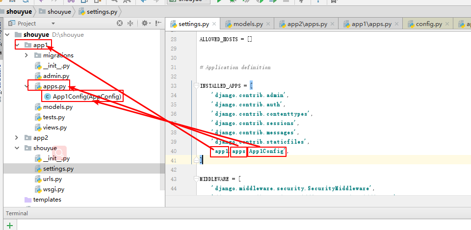


简单来说就是一个项目不便于管理，就出现了app这些小项目

## 1.url 自带

```python
url(r'^admin/', admin.site.urls),
```

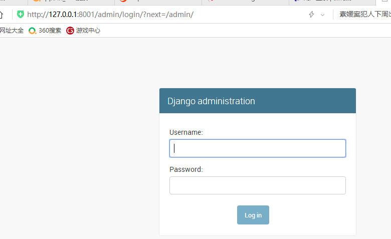

### ufl与视图函数views的连接

#### 项目url.py

```python
# 先要导入views模块
from app1 import views
urlpatterns = [
    url(r'^admin/', admin.site.urls),
    url('login',views.login)# 通过app视图views函数找到login
]
```

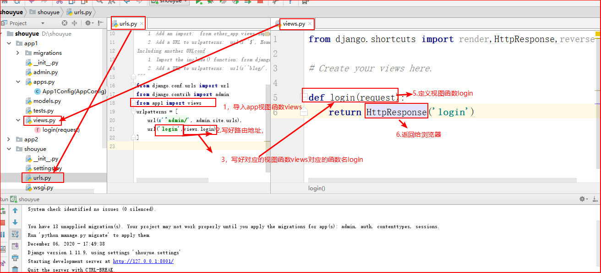

## 2.templates模板

### 2 模板路径配置:

1 templates文件夹
2 settings里注册一下

#### 2.settings里注册一下   注意一下项目的配置图解

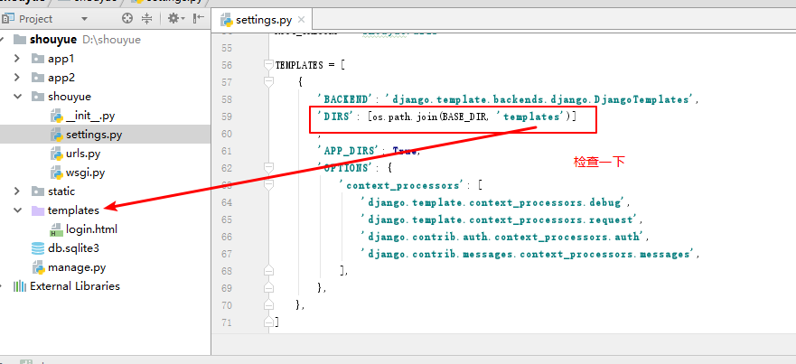

#### 模板流程

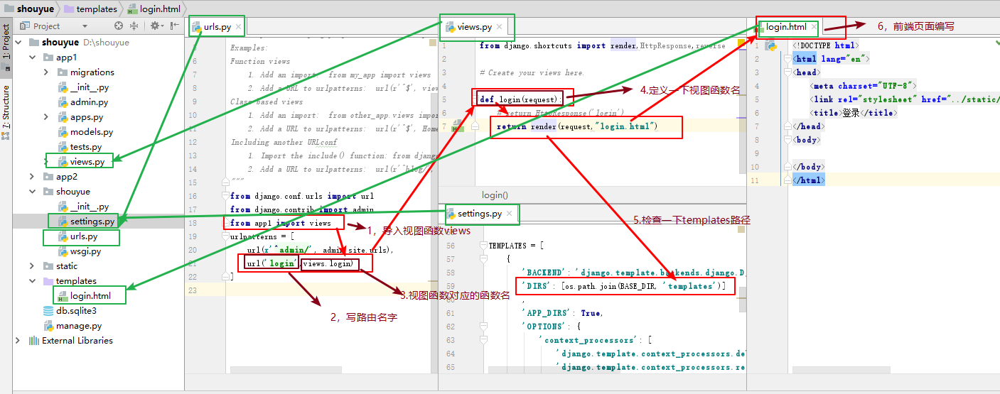

## 3.static配置

### 3 静态文件配置:

```
1 STATIC_URL = '/static/'    一般不要改
2 创建一个static文件夹       一般不要改
3 STATICFILES_DIRS=[
	os.path.join(BASE_DIR, 'static'),  创建的文件夹路径(可以写多个)
```

### 3.静态文件配置图解

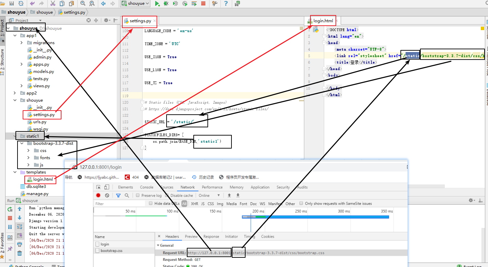

找不到报错404

## 4 完整版登录功能

### POST请求图解

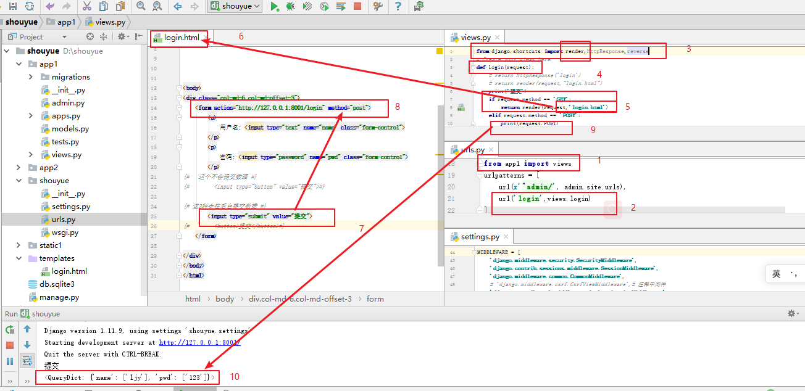

### request.POST的含义

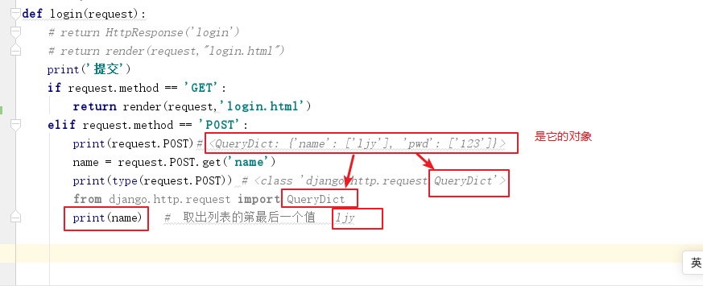

### request.POST.getlist('name')


### 1 login.html

```
		***重点***1 action:提交到后台的地址三种写法:
				1 http://127.0.0.1:8000/login
				2 /login/   推荐用
				3 空
			  2 method  post方式
			  3 <input type="submit" value="提交">或<button></button>
				type不可以是button
		   <form action="http://127.0.0.1:8000/login" method="post">
			<p>用户名:<input type="text" name="name" class="form-control"></p>
			<p >
				密码:<input type="password" name="pwd" class="form-control">
			</p>
			<input type="submit" value="提交">
		</form>
```

### 	


### 2 视图层:

​		

```
1 request.method  ----前台提交过来请求的方式
		2 request.POST(相当于字典)----post形式提交过来的数据,(http请求报文的请求体重)
		3 request.POST.get('name') ----推荐用get取值(取出列表最后一个值)
		4 request.POST.getlist('name')-----取出列表所有的值_
		5 前台get方式提交的数据,从request.GET字典里取
```

### get提交图解

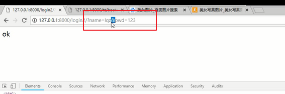

### 3 链接数据库(防止注入,推荐以下写法)

```
cur.execute('select * from user where name=%s and password=%s ',[name,pwd])
```

#### 登录访问数据库图解

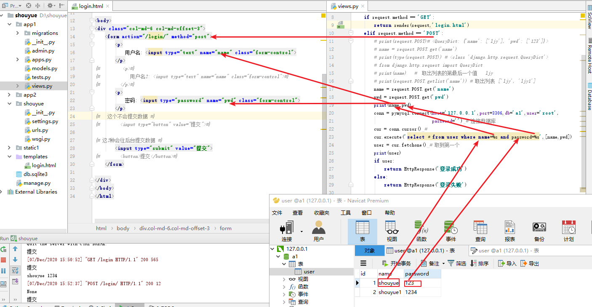

## 5 get请求和post请求

```django
get:获取数据,页面,携带数据是不重要的数据(数据量有大小限制)
	post:往后台提交数据	
```

## 6 新手三件套总结

```
1 render--返回页面
		默认会去templates里找,注意路径
	2 redirect--重定向
	3 HttpResponse
	本质:都是返回HttpResponse的对象
```

## 7 pycharm连接mysql

### 1 点击右边的database

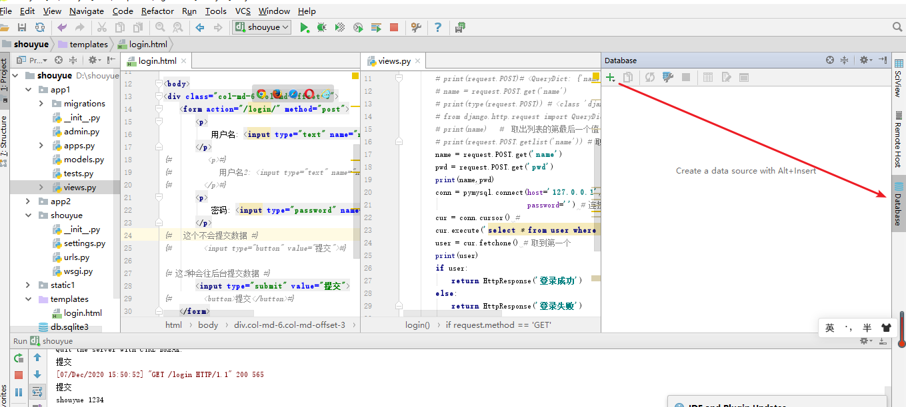

### 2.点击加号,找到mysql

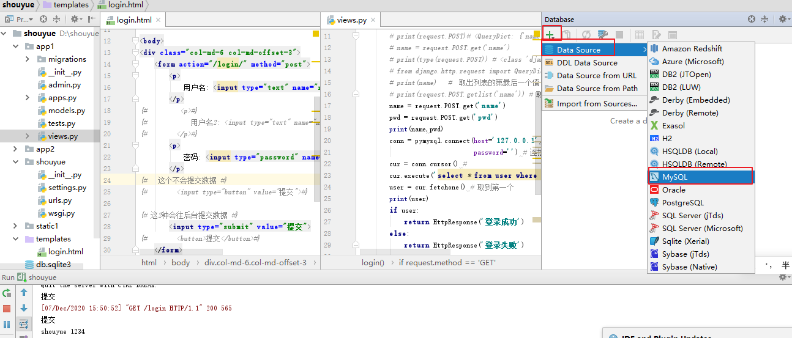

### 3.添加数据库名字，用户名，密码，下载msyql

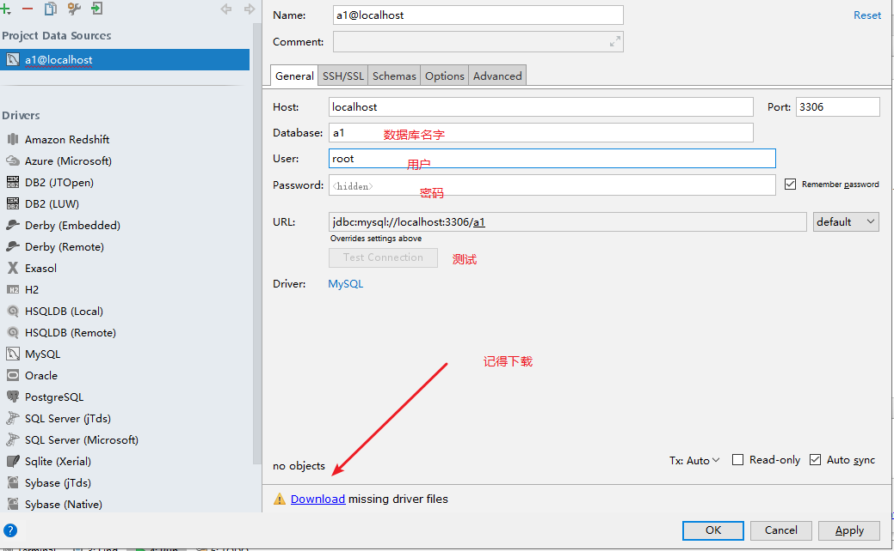

### 4.测试

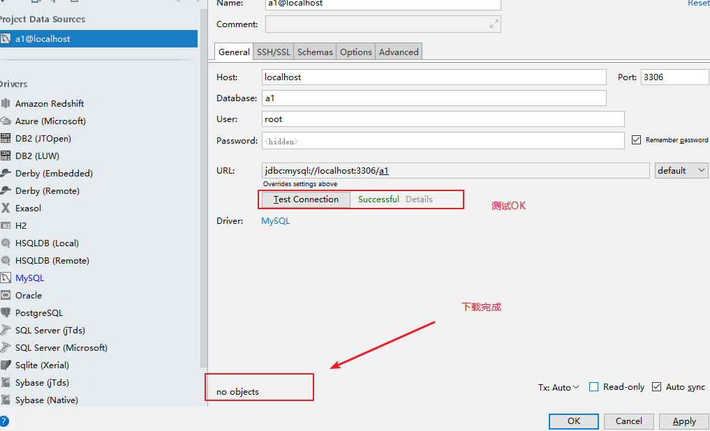

## 8.orm介绍

不管是java，其他语言只要是web开发都有这个

```
1 ORM即Object Relational Mapping，全称对象关系映射。
# 思考一下
# 对象关系映射 ，
# 1.就是程序的类对应的我的mysql的表
# 2.类里面的数据属性对应的mysql字段 
# 3.那么我只需要写这些python语法就可以把数据查出来，爽死
# 4.其实就是把我们的sql语句翻译成sql,拿到数据库里面去执行，执行完以后再翻译回来
# 5。返回回来是一个字典的格式的数据，再回到程序，它就变成了类对应的对象，所以说查出来的数据是一个个的对象。
# 6.那么这样就爽了。我们拿到的是一个个对象，那么对象点什么就是什么的字段信息，
比如对象.name 就是name字段像这样
	优点: 
		1 不用写sql,不会sql的人也可以写程序,爽死
		2 开发效率高
	2 缺点:
		1 可能sql的效率低
1 ORM即Object Relational Mapping，全称对象关系映射。
	优点: 
		1 不用写sql,不会sql的人也可以写程序
		2 开发效率高
	2 缺点:
		1 可能sql的效率低
	3 如何使用:
		如果连接mysql:在setting里配置:
		    'default': {
				'ENGINE': 'django.db.backends.mysql',
				'HOST': '127.0.0.1',
				'PORT': 3306,
				'USER': 'root',
				'PASSWORD': 'admin',
				'NAME': 'lqz',
			}
		在app下的__init__.py里写:
		import pymysql
		pymysql.install_as_MySQLdb()
	
	4 django-orm:
		1 不能创建数据库(需要手动创建数据库)
		2 可以创建数据表
		3 可以创建字段
		
	5 数据库迁移
		1 python3 manage.py makemigrations   ----记录一下数据库的变化
		2 python3 manage.py migrate          ----将变化同步到数据库中
	6 增加字段
		注意:后来增加的字段,需要有默认值
		phone=models.CharField(max_length=64,default='120')					
```

### 图解orm

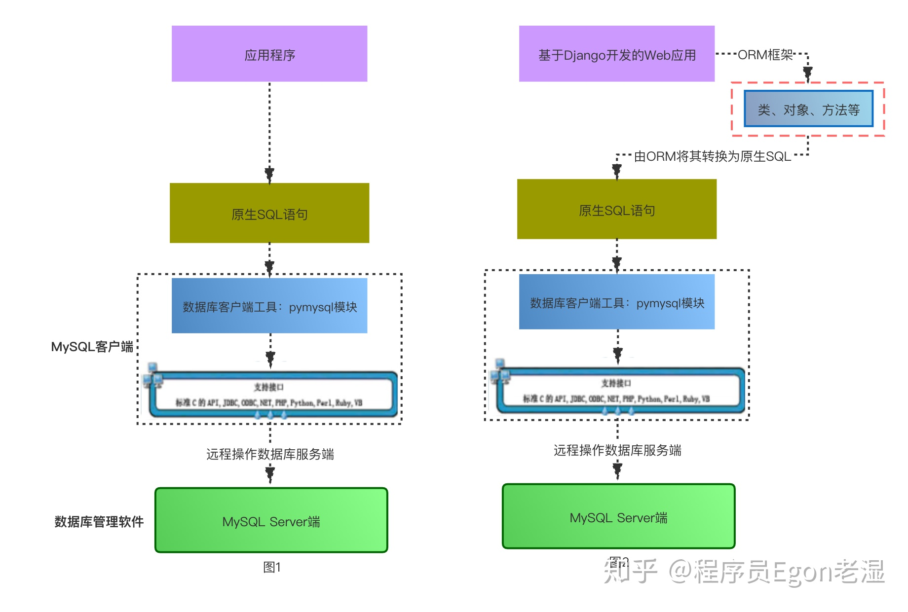

### 把mysqldb连接数据库替换成pymysql连接图解

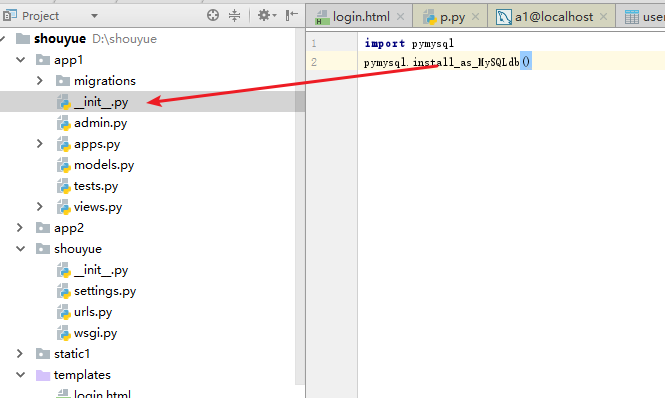

### 连接pymysql图解

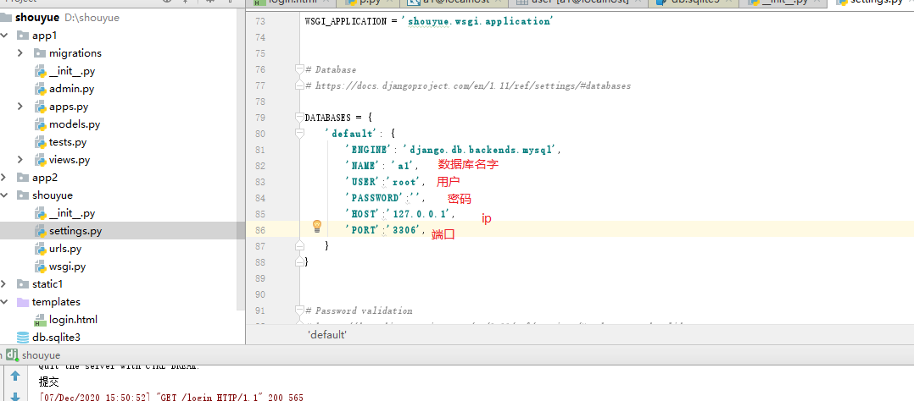

### django三件套

```
#### 1 render--返回页面	
```

​		默认会去templates里找,注意路径

```
#### 2 redirect--重定向
```

​		重新用get请求另一个html

#### 3 HttpResponse

​	本质:都是返回HttpResponse的对象

### 图解django三件套

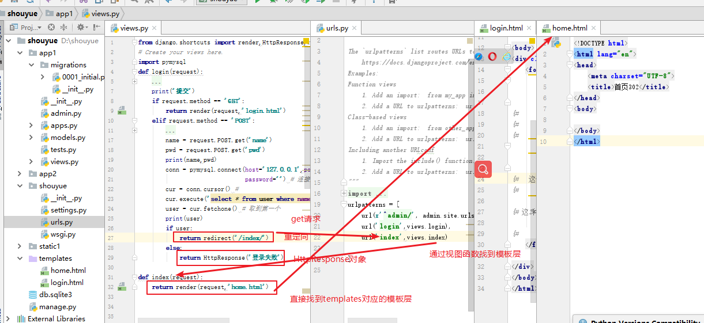

### 数据库迁移图解

1，把mysqldb连接数据库替换成pymysql连接图解

2，连接pymysql图解

#### 3，1 python3manage.pymakemigrations----记录一下数据库的变化图解

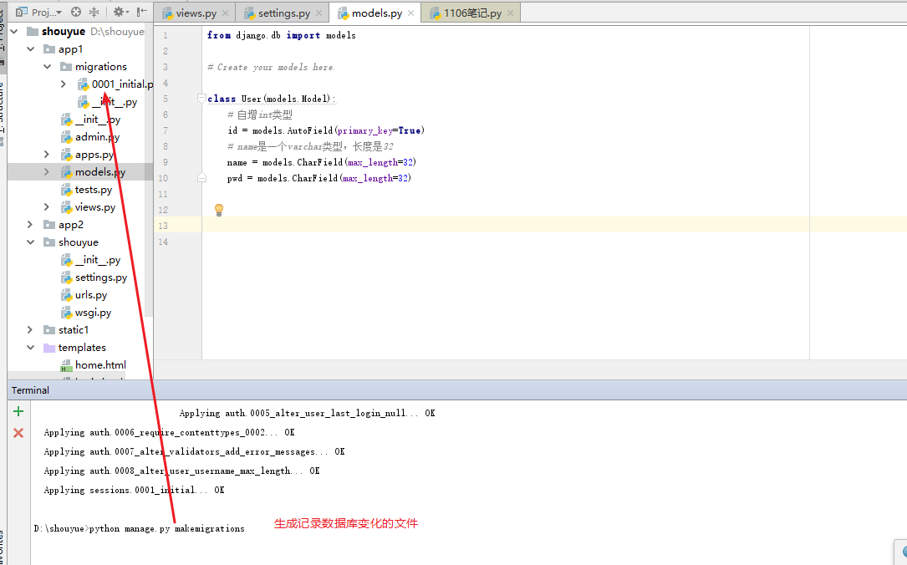

#### 2 python3manage.pymigrate----将变化同步到数据库中图解

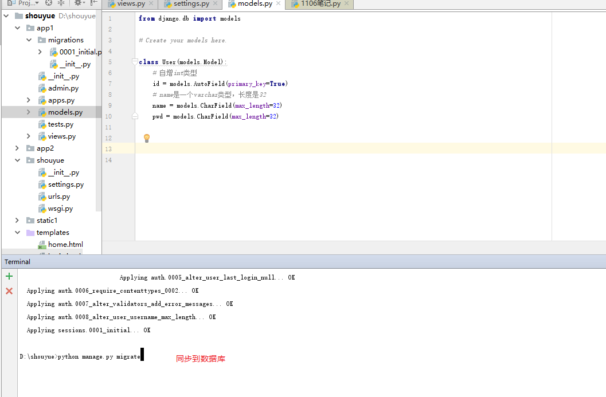

#### 4,后来增加的字段图解

##### 1.  方法一 命令选择pythonmanage.pymakemigrations图解

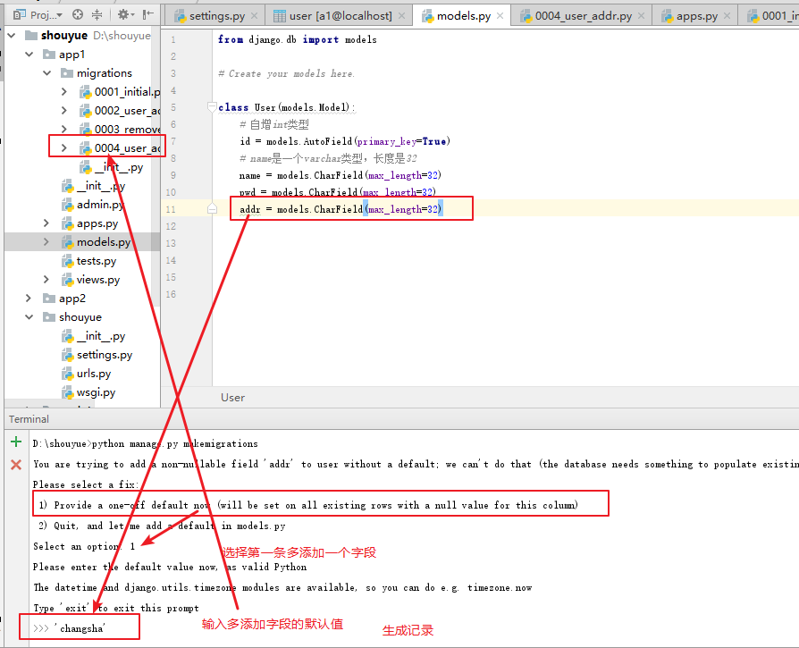

2.然后迁移命令python3 manage.py migrate   

##### 1.2 方法二 添加一个字段的约束 默认值 default 图解

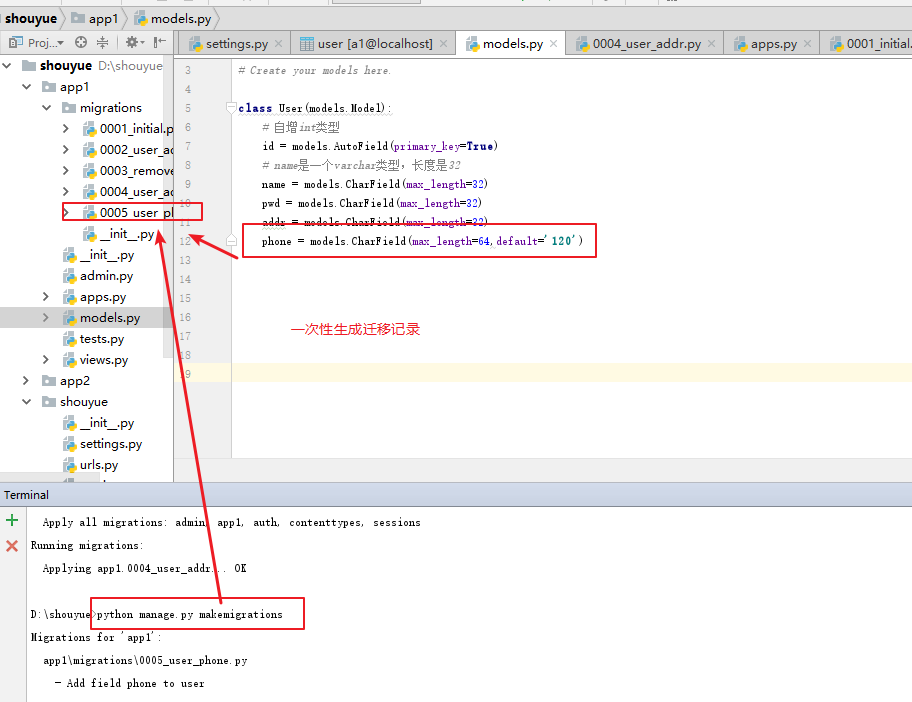

2.然后迁移命令python3 manage.py migrate  

#### 结果

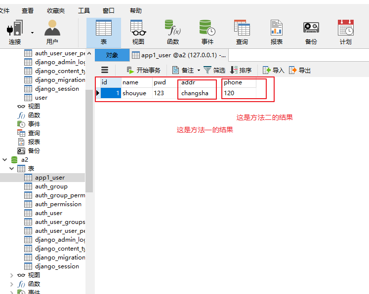

1，把mysqldb连接数据库替换成pymysql连接图解

#### 5.后来修改的字段

##### 直接修改类的属性

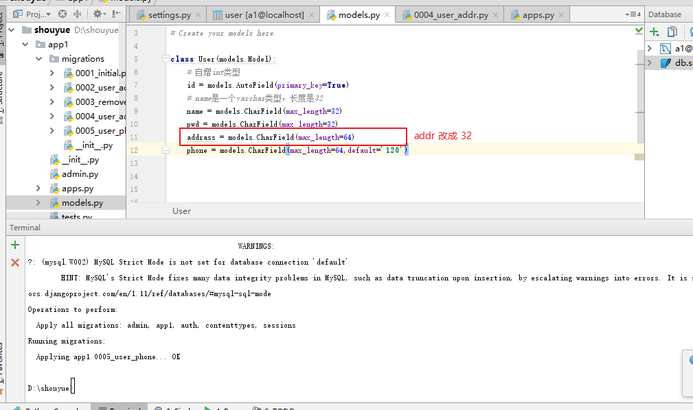

##### 再写命令

1 python3 manage.py makemigrations   ----记录一下数据库的变化
		2 python3 manage.py migrate          ----将变化同步到数据库中

## 表User的增删改查

？？


