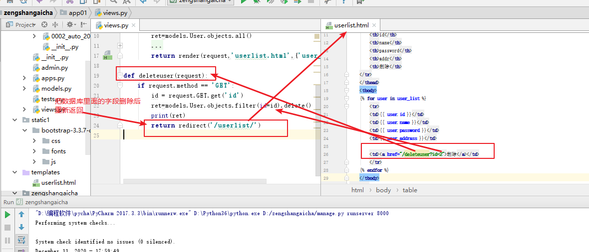
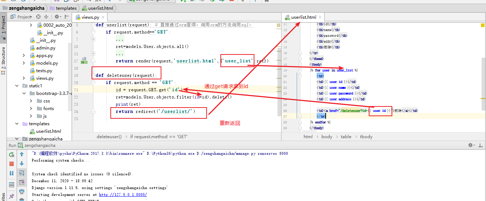
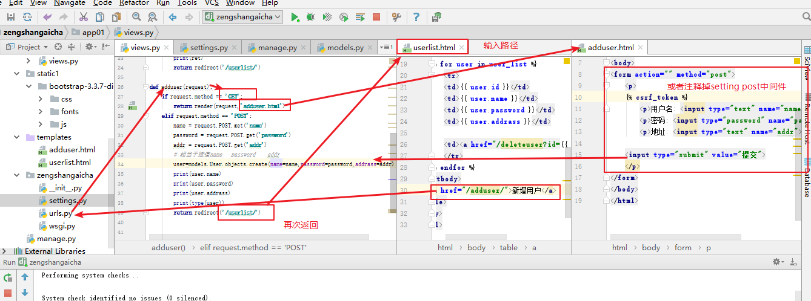

# django用户的增删改查

## 第一步

### 在app里面写入

```python
import mysql
pymysql.install_as_MySQLdb()
```

## 第二部

### 数据库迁移

```python
python manage.py makemigrations
python manage.py migrate   
```

## 注意

模板的mysql字段的内容 渲染在视图函数 返回的时候就已经传入了模板

模板还没有到前台就完成了，是在reder里面替换的

## 增加图解


## 删除图解





## 添加图解



## 修改图解

