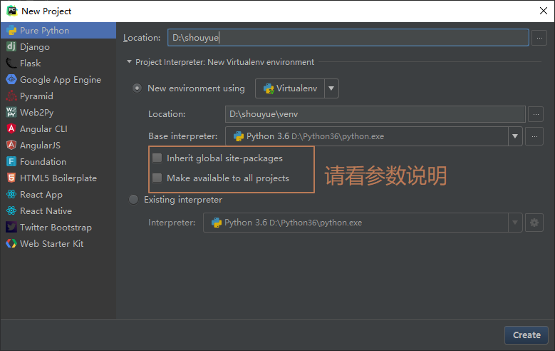
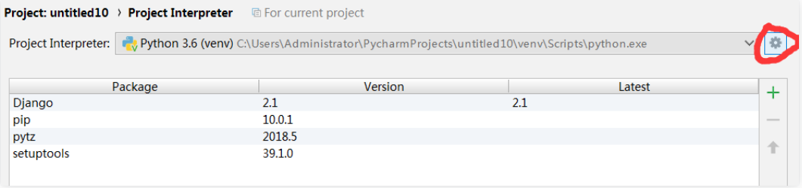
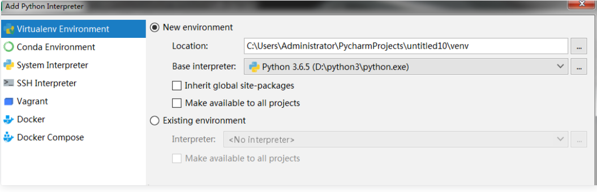

# 虚拟环境

## 定义

其实就是把python和python的模块拷贝了一份

## 作用

不同项目就有不同的解释器

 需求：
     --公司之有一台服务器
     -目前运行这一个5年前开发的Django项目，基于1.5
     -现在要基于Django2.0开发一套程序
     -无法卸载原来的版本，必须还要安装新版本 

## 创建虚拟环境的方法

```python
安装：
     -pip3 install virtualenv
   创建虚拟环境：
     -（1）virtualenv env_django（创建虚拟环境）

 　-（2）virtualenv env_django(创建纯净环境)
     -（2）virtualenv --system-site-packages env_django（创建环境，继承原安装的模块）
   激活该虚拟环境：
     -windows进到目录里，的Script文件夹输入：activate
     -linux：soruse env1/Script/activate
   退出虚拟环境：
     -deactivate
   在pycharm中使用虚拟环境
     -files--settings--Project--Project Interpreter--add选择虚拟环境路径下的python.exe即可
```

## 三 在Pycharm下创建 新建项目

 File--->New Project--> 出现如下图，点击Project Interpreter：New Virtualenv environment 



## 四 已有项目使用和创建虚拟环境

 打开Project Interpreters页面：文件(file)——>设置(setting)——>项目(Project)——>Project Interpreters； 



 点击右边的配置按钮，选择**Add**。这时会弹出**Virtual Environment**的对话框； 



## 五 参数说明

- Name中填写新虚拟环境的名字，或者使用默认名字，方便以后安装第三方包和其他项目使用；
- 在Location中填写新环境的文件目录;
- 在Base interpreter下拉框中选择Python解释器；
- 勾选Inherit global site-packages可以使用base interpreter中的第三方库，不选将和外界完全隔离；
- 勾选Make available to all projects可将此虚拟环境提供给其他项目使用。