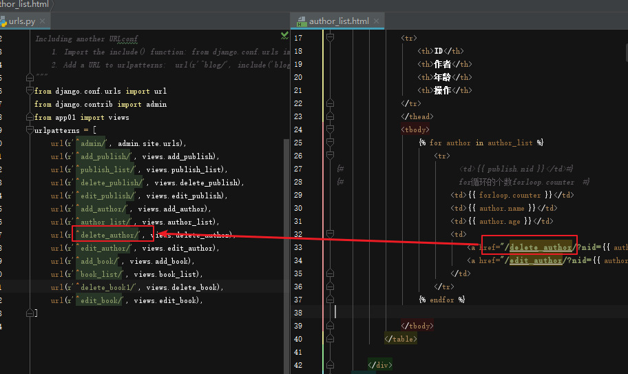
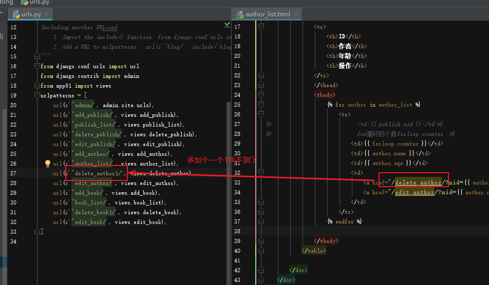
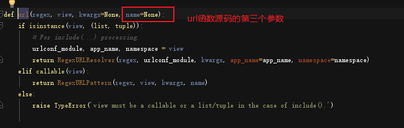
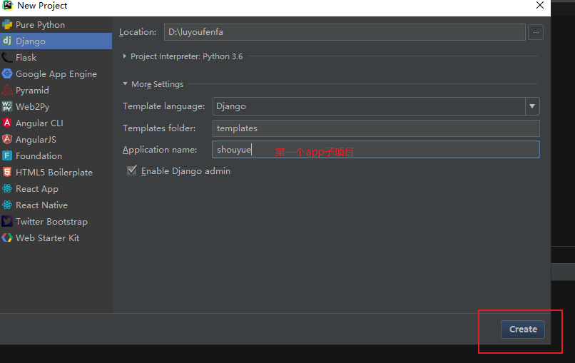
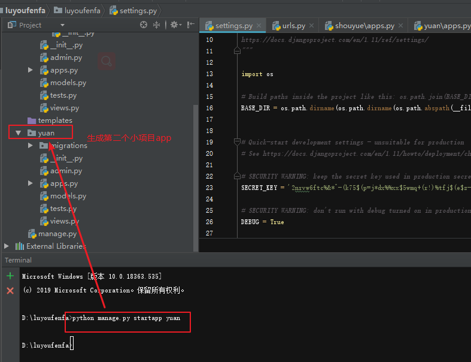
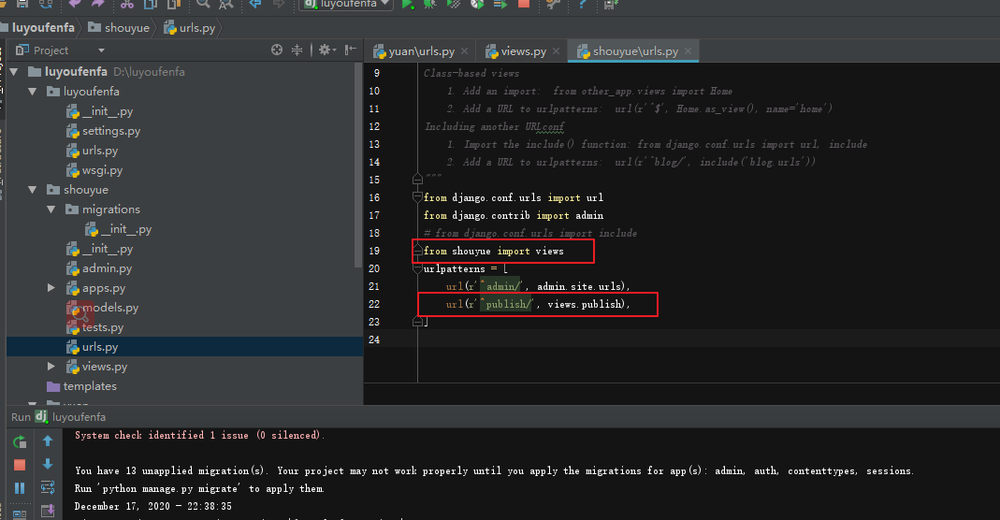
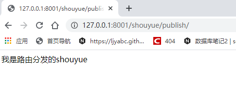
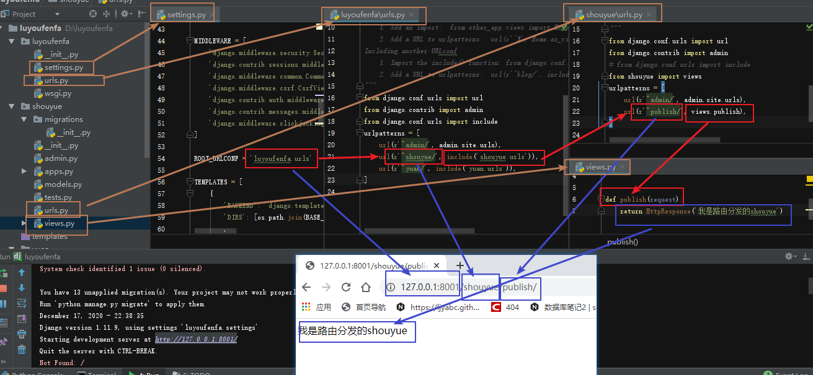

# 路由层

## 1.简单配置

```python
本质就是一个函数
-第一个参数是正则表达式(如果要精准匹配:'^publish/$')
		-第二个参数是视图函数(不要加括号)
		-url(r'^admin/', admin.site.urls),
```

### 默认值

```python
-url('正则',函数,默认值,name)
			url(r'^author_update/', author.author_update,{'id':1}),
```

## 2.无名分组

### -按位置传参

在客户端的输入网址的时候会自动补全/

```
		-分组之后,会把分组出来的数据,当位置参数,传到视图函数,所以,视图函数需要定义形参
		-url(r'^publish/([0-9]{4})/([0-9]{2})$', views.publish),
		-def publish(request,*args):   视图函数可以这样接收
```

## 3. 有名分组

### -按关键字传参

```
		-有名分组之后,会把分组出来的数据,当关键字参数,传到视图函数,所以,视图函数需要定义形参,形参名字要跟分组的名字对应,与顺序无关
		-url(r'^publish/(?P<year>[0-9]{4})/(?P<mounth>[0-9]{2})/$', views.publish),
		-def publish(request, mounth,year):
		
```

### 有名分组和无名分组,不要混用

注意

## 4. 反向解析

### 1含义

```django
在使用Django 项目时，一个常见的需求是获得URL 的最终形式，以用于嵌入到生成的内容中（视图中和显示给用户的URL等）或者用于处理服务器端的导航（重定向等）。人们强烈希望不要硬编码这些URL（费力、不可扩展且容易产生错误）或者设计一种与URLconf 毫不相关的专门的URL 生成机制，因为这样容易导致一定程度上产生过期的URL。
```

### 2通俗易懂的含义

```
就是我们按照正常的方法写模板层点击a标签的时候，不管路由怎么变，都能解析
```



#### 但是当路由一变化,就找不到了



#### 总结理解

```
所以说就是去解析一个动态的路由，也可以说是把模板的a连接和路由绑定在一起，自动进行解析
```

### 3代码语法

#### 1.url路由层统一定义，让模板层或者视图函数去解析它

##### 1.1先命一个名url源码urls.py的文件



##### 1.2url.py无参数

```python
url(r'^publishadd133/$', views.publishadd,name='反向解析的名字'),
```

##### 1.3url.py无名分组

```python
url(r'^publishadd/([0-9]{4})/([0-9]{2})/$', views.publishadd,name='反向解析的名字'),
```

##### 1.4url.py有名分组

```python
url(r'^publishadd/(?P<year>[0-9]{4})/(?P<mounth>[0-9]{2})/$', views.publishadd,name='反向解析的名字'),
```

#### 2.templates模板层文件夹的文件publish.html

去找到url里面的name='反向解析的名字'这个参数名字

##### 1.1publish.html无参数

```html
<a href="">点击进行反向解析</a>
视图层
def publish(request):
	pass
```

##### 1.2publish.html无名分组

```html
<a href="">点击进行反向解析</a>
视图层
def publish(request,year,month):
	print(year,month)
```

##### 1.3 publish.html有名分组

```html
第一种
<a href="">点击进行反向解析</a>
第二种
<a href="">点击进行反向解析</a>
视图层
def publish(request,year,month):
	print(year,month)
```

#### 3.views.py视图层反向解析

##### 先导入模块reverse

```python
from django.shortcuts import reverse
```

##### 1.views.py无参数

```python
def publish(request):
    if request.method == 'GET':
        url = reverse('反向解析的名字')# 对应的是publishadd
        # 然后重定向
        return redirect(url)
```

##### 1.2views.py无名分组

```python
def publish(request):
    if request.method == 'GET':
        url = reverse('反向解析的名字',args=(1800,22)) # 对应的是publishadd
        # 然后重定向
        return redirect(url)
```

##### 1.3views.py有名分组

###### 第一种

```python
def publish(request):
    if request.method == 'GET':
        url = reverse('反向解析的名字',args=(1800,22)) # 对应的是publishadd
        # 然后重定向
        return redirect(url)
```

###### 第二种

```python
def publish(request):
    if request.method == 'GET':
        url=reverse('反向解析的名字',kwargs={'year':2018,'mounth':12}) # 对应的是publishadd
        # 然后重定向
        return redirect(url)
```

## 5.路由分发

### 第一步创建一个新的项目

#### 1.自动创建第一个app，shouyue



#### 2.手动创建第二个app，yuan

python manage.py startpp yuan



#### 3.需要新建shouyue小项目app的路由urls.py文件


##### 1.修改shouyue  app 的urls.py



##### 2.修改shouyue  app 的views.py

```python
def publish(request):
    return HttpResponse('我是路由分发的shouyue')
```

#### 4.效果



#### 5.整个流程总结



## 6 名称空间

-路径重命名,可能会重复,反向解析,就会出问题
-指定名称空间

```python
-url(r'^blog/',include('blog.urls',namespace='blog')),
		-子路由:url(r'^publish/$', views.publish,name='test'),
		-反向解析:
			-视图层:url = reverse('blog:test')
			-模板层:
		***一般不要用***
			子路由:url(r'^publish/$', views.publish,name='app01_test'),
```

## 7 伪静态

```python
-路由:url(r'^book/(?P<id>\d+.html)',views.book),
		-访问:http://127.0.0.1:8000/book/4.html
```

## 8, http://127.0.0.1:8000/ 访问这个路径,匹配到图书列表

```python
urlpatterns = [
			url(r'^$',views.book),#根路径,响应到指定视图函数:
			.....
			url(r'',views.errors),#没有配置的路径,响应到错误的视图函数:
		]
```

5 路由匹配不上,调到404的页面

## 9.路由不会自动加斜杠

为假,不会加反斜杠

```python
	# APPEND_SLASH=False
```