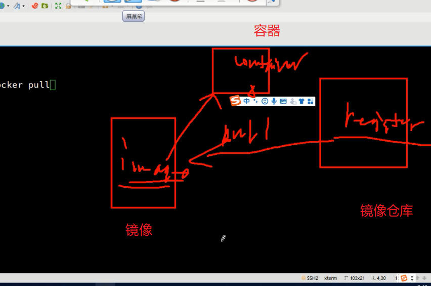

# ----------day1----------

# centos系统安装后的基本配置:

## CentOS的官方站

> ```
> http://www.centos.org,
> http://vault.centos.org/   
> ```
>
> 

### 阿里云站点

> http://mirrors.aliyun.com

## 1.常用软件安装:

> ```
> yum install -y bash-completion vim lrzsz wget expect net-tools nc nmap tree dos2unix htop iftop iotop unzip telnet sl psmisc nethogs glances bc
> ```
>
> 
>

## 2.主机名和网络

>  hostnamectl set-hostname python3
>  echo "10.0.0.100 python3">>/etc/hosts
>

## 3.关闭防火墙

### 确定防火墙

> iptables -L
> iptables -F

### 永久关闭

> ###### systemctl disable firewalld

### 查询防火墙

> [root@python3 ~]# getenforce 
> Enforcing
> [root@python3 ~]# setenforce 0
> [root@python3 ~]# getenforce 
> [root@python3 ~]# vim /etc/selinux/config 

### 三种防火墙状态

> enforcing - SELinux security policy is enforced.
> permissive - SELinux prints warnings instead of enforcing.
>
> ###### disabled - No SELinux policy is loaded.

# 2.Centos命令基本结构

## Linux命令

### 命令的基本构成

#### 一般的套路

> 命令体    选项      参数(对象)
> ls        -l        /var

#### 参数:文件

文件类型:
d :目录
f :普通文件
l :链接
b :块设备,磁盘 光驱
c :字符设备
p :管道
s :套接字

#### 命令提示符:

[root@oldboy ~]#   
[oldguo@oldboy ~]$

# 四.Centos常用快捷键

## 常用快捷键(bash shell支持的快捷键)

rm -rf
ctrl + c  cancel 取消当前的操作 
ctrl + l  (小写字母L)  clear（命令）
ctrl + d  退出当前用户 
ctrl + r查找（会自动弹出历史命令）。 history|grep

### [TAB]:

​	1.命令补全
	2.参数补全
历史history

### system 加tab键

##### 了解一下ctrl+:

###### ctrl + a  把光标移动到行首 

###### ctrl + e  把光标移动到行尾

ctrl+ u  把光标到行首的内容删除/剪切

###### ctrl + y  粘贴 

delete    光标所在处从前往后删除内容
ctrl + k  把光标到行尾的内容删除/剪切 
ctrl + →  向右移动一个单词 
ctrl + ←  向左移动一个单词

ctrl + s  锁屏 
ctrl + q  解锁

##### tab键命令补全

# 五.Linux命令帮助及关机重启命令

## 1.获取帮助

--help
man 命令的需求
info更加详细

## 2.关机重启

>######  reboot 
>
>###### 关机
>
>######  poweroff

六.Linux FHS文件系统层次化标准
============================
## linux命令分类

### 绿色的是二进制的可执行文件

### 1.针对不同文件的管理命令

### 1.1 目录

### FHS 文件系统层次化标准

ls /
ls /bin
ls /boot启动文件
ls /dev/
ls /etc 配置文件
ls /home 用户的家目录

### 1.2绝对路径:从"/"开始一个具体路径

### 1.3相对路径:从当前目录开始的具体路径(pwd可以查看当前所在目录)		

/3层/oldboy/教室3 
/3层/oldboy/教室2

# 七.Linux目录基础管理

## 1.1.1 创建目录:

### 根下面创建一个目录

> mkdir /oldboy

### 在当前所在目录创建目录 

> mkdir oldboy 

### 一次性创建3层目录

> mkdir -p /a/b/c

## 1.1.2 <u>查询目录</u>

### 只能看一层

> ls -ld /oldboy 

### 直接看所有目录

> tree /a 

### 只看2层

> tree -L 2 /

## 1.1.3 删除目录(危险)

> rm -rf /oldboy  

### 通过文件句柄,有可能可以找回丢失数据(前提:不能重启,不能有大量数据写入)

## 1.1.4 修改目录(剪切,复制)

> mv /root/oldboy/ /tmp

### 剪切重命名

> mv /root/oldguo/ /tmp/oldguo.bak

### 只是重命名

> mv oldboy old

> cp -r /tmp/old /

### 把权限也复制

> cp -a 

### 创建a1-10

> mkdir a{1..10}

## 1.1.5 切换目录

> cd /
> cd /oldboy
> cd  oldboy 
> cd .. 

### 返回上一次的目录

> cd -
> cd 

小技巧:

### 创建a1-10

> [root@python3 tmp]# mkdir a{1..10}
> [root@python3 tmp]# mkdir dir{a..f}

### 所有

> [root@python3 tmp]# ls -ld dir*
> [root@python3 tmp]# rm -rf dir*

# 八.目录与文件管理

## 1.2 普通文件

### 1.2.0 种类

ASCII TEXT:纯文本文件(操作最多的)
LSB Exe:二进制的可执行文件(命令,程序)
压缩文件:zip tar  gz  bz2   cpio  iso
二进制数据文件:
等.

## 1.2.1 文件创建

> ######         touch a.txt (不能创建同名)

## 1.2.2 文件删除

> ###### 	rm -rf a.txt

## 1.2.3 文件查看

> ###### 	ls -l a.txt    看文件属性

### (1)小文件内容查看

> ###### 	cat /etc/passwd
>
> 同时看2个内容
> 	cat /etc/passwd /etc/shadow
> 带序号显示
> 	cat -n /etc/passwd 

### (2)分页显示大文件内容

> ​	more /var/log/secure
> 更好可以上下翻页
> 	less /var/log/secure 
>

### (3)文件前多少行

> ​	head /etc/passwd
>
> 3行
>
> ​	head -n3 /etc/passwd
> 	head -3 /etc/passwd
>

### (4)文件后多少行

> 2行
> tail -2 /etc/passwd
>

#### 监控

> tail -f /var/log/secure
>

## 1.2.4 剪切 复制

> ###### mv 命令和目录的操作一样
>
> ###### cp 命令和目录的区别不需要加-r (加上也不报错)

## 1.2.5 内容修改

#### 重定向 

>   覆盖重定向
>
>   echo "10.0.0.100 python3" >/etc/hosts
>
>   cat /etc/passwd >a.txt
>
>   >  追加重定向
>   >  cat /etc/passwd >>a.txt
>   >  将内容追加
>   >  echo "10.0.0.100 python3" >>/etc/hosts

666

#### cd 到当前目录

> cp /etc/psswd ./
>

#### vim 编辑器

命令模式:初始模式

vim passwd 
功能: 

#### 1.查看文件内容

##### 上下左右光标移动

​	page up  page down翻页
666
	G 光标到达最后一行
	1G 光标到达第一行(gg)
	10G 第10行
	^ 光标到达行首
	$ 光标到达行尾

##### / 搜索关键字

#####        yy 复制光标所在行

​	Nyy 复制N行
	dd  删除/剪切
	Ndd 删除/剪切N行
	p  粘贴
	x(del) 删除光标所在字符

##### dG  删除光标到文本末尾

​	d$  从光标删除到行尾,包括贯标所在字符
	d^  从光标删除到行首,不包括光标所在字符

##### r   替换光标所在字符

​	ZZ  保存退出
	u   撤销上次操作

# 九.VIM的编辑模式与末行模式

## 1.编辑模式:

a :在光标之后录入数据
i :在光标之前录入数据
o :在光标下一行开启新行录入数据
A
I
O
ESC 

小技巧:每编辑完一行就ESC,退回到命令模式

## 2.末行模式

### 只是退出

> :q!
>

### 保存退出

> :wq!
> :set nu  
> :set nonu
>

### 替换退出

> :%s/root/ROOT/g
>

#### 链接(快捷方式)

> ln -s passwd passwd.lnk
>


> ls  
> ls -l  
> ls -ld
> ls -al 
> ls -ltr
>

# 十.磁盘.文件系统管理,raid技术

## 磁盘   和    文件系统

## 2.1 企业级磁盘类型

SAS    
容量  :900G   
	主机版
	存储版
转速:15K  
品牌:IBM HDS EMC
缓存:
接口速度:16Gb
SSD: 
Sata3
PCI-E 
Flash盘

## 2.2 文件系统

### 方便用户使用和管理磁盘硬件的,辅助系统(Filesystem)

### Linux文件系统类型:

​	ext2
	ext3 
	ext4
	XFS
十

## 2.3 文件系统管理

> ​	
> [root@python3 ~]# ls -l /dev/sd*
> brw-rw---- 1 root disk 8,  0 Jan  3 15:28 /dev/sda
> brw-rw---- 1 root disk 8,  1 Jan  3 15:28 /dev/sda1
> brw-rw---- 1 root disk 8,  2 Jan  3 15:28 /dev/sda2
> brw-rw---- 1 root disk 8, 16 Jan  3 15:28 /dev/sdb
> [root@python3 ~]# fdisk -l
> 	
>

### 2.3.1 分区

> ###### 	fdisk   /dev/sdb 
>
> ​	m
> 	n
> 	p 
> 	w 

### 百度以下:

##### 1.首先我们要添加一块足够我们使用的硬盘（我这里添加一块20G 的硬盘） 

 

##### 2.打开我们的命令行模式， 

```
fisk-l
```

 

##### **3.**在新建逻辑卷之前，我们要先新建一个物理卷，以便我 们创建逻辑卷组的时候引用。 

```
pvcreate /dev/sdb
```

##### 4.创建完了以后我们要先查看我们系统中的逻辑卷组

#####  

```
 vgdisplay
```

#####    

（红框中的名字即我们后面要使用的卷组名）  

##### 

```
vgextend VolGroup /dev/sdb 
```

##### **5.**下面我们就开始对根分区对应的逻辑卷进行扩展  

```
df -h
lvextend -L +19G -n /dev/mapper/VolGroup-lv_root 
```

#####  **6.**扩展完成以后，是不会立刻生效的，我们需要输入  

```
resize2fs /dev/mapper/VolGroup-lv_root
df -h
```


### 2.3.2 格式化成文件系统(XFS)

> ###### 	mkfs.xfs /dev/sdb1 
>
> ​	

### 2.3.3 挂载设备

> ###### mkdir /data
>
> mount /dev/sdb1 /data	
>

​	

### 2.3.4 查看挂载的磁盘使用情况

> ###### df -h

### 2.3.5 自动挂载文件系统

> ###### vim /etc/fstab
>
> /dev/sdb1    /data    xfs    defaults    0 0 

#### 使用UUID更加安全

UUID=9fb2ec36-6a60-4394-9bfa-369261844d56 /data xfs defaults 0 0

## Raid

#### 功能特性:

​	1.将多块磁盘合并成一块磁盘,提供更大的存储空间
	2.可以提供更高的IO能力
	3.数据物理层面的高安全

#### Raid的工作级别	:

raid0:条带化功能,性能极高,安全性和单盘一样
至少两块盘,理论上盘越多性能越高

raid1:镜像功能,性能没有明显提升,安全性高.	
	浪费一半空间

raid10:镜像+条带化 ,至少四快盘,性能和安全兼顾
浪费一般空间	

raid5:带有校验功能的条带化	
存储数据时,根据数据计算校验值,存储到第三块盘.
写入性能较低
读数据性能较高
至少三快盘,只允许一块盘损坏,浪费1/n的磁盘空间

适合于读多写少的场景	

# 十一.Linux用户和组管理

## 3.用户,组,权限

### 3.1 用户的作用

​	登录系统
	管理系统对象

### 3.2 用户的定义

​	用户名(uid),密码,家目录(/home/oldboy),家目录下会有环境变量文件等.
	每个用户都必须有一个工作组,创建时没指定,自动创建一个同名的组

### 3.3 组

​	组名字,GID

### 3.4 用户和组的管理

#### 	组的管理:

> ​	groupadd -g 1001 dev
>                 groupadd -g 1001 sa
> 	groupadd -g 1001 dba
> tail -3 /etc/group
> dev:?:1001:
> dev:?:1001:
> dba:?:1003:
>
> groupdel
> groupmod -g 10086 dev
>

#### 用户的管理:

> useradd -u 10011 -g dev oldguo
> id oldguo
>

##### 设置密码

> passwd oldguo
>

##### 切换用户

> su - oldboy
>

##### 删除

> userdel -r oldboy
>

##### 修改id

> usermod -u 3000 oldguo
>

# 十二用户,组,权限

## 1权限:

## 权限是作用在文件上的属性.

## 普通权限的规划:

​	r   4
	w   2 
	x   1

rw-     r--       r--               root         root             passwd


               目录                 				文件
r               ls                  				cat more    ,vim
w              目录下的修改        					vim   > 
x              目录下所有操作都依赖于x              可执行程序

### rwxr-xr-x

> chmod -R  755 /data 
> chwon -R oldguo:dev /data
> chmod -R 755 /data
> chown -R oldguo:dev /data

## 2程序管理666

### 查看所有进程

> ps -ef
> ps -ef|grep mysql 
> kill 1234
> kill -9 1234
> pkill mysqld
>

## 3安装启动httpd

```
yum install -y httpd

[root@python3 ~]# systemctl start httpd
[root@python3 ~]# systemctl restart httpd
[root@python3 ~]# systemctl stop  httpd
[root@python3 ~]# systemctl restart httpd
```


## 4网络管理

> ip a 
> ifconfig 
> ping 
>

### 修改IP地址

> vim /etc/sysconfig/network-scripts/ifcfg-eth0 
>

### 重启网卡

> systemctl restart network
>

# ---------------day3------------

# 软件包管理

## 一.经典互联网架构

## 昨天补充:

## 查看已启动服务的端口

> ###### netstat -tulnp
>
> netstat -tulnp |grep 80
> ss -tulnp|grep 80

## Linux要能上网

## 二.使用网络yum源安装软件

## 1.掌握Linux软件包安装方法

### 2.1 rpm包管理

#### 2.1.1 光盘挂载

> cd /etc/yum.repos.d/
>  mount /dev/cdrom /mnt
>  cd  /mnt
>  ls
>

#### 2.1.2 安装rpm包

```
rpm -ivh vsftpd-3.0.2-22.el7.x86_64.rpm
下面一个可以升级
rpm -Uvh vsftpd-3.0.2-22.el7.x86_64.rpm
```


#### 2.13 卸载rpm

```
rpm -e vsftpd-3.0.2-22.el7.x86_64
```


#### 2.1.4 rpm包的查询

[root@python3 ~]# rpm -q vsftpd
vsftpd-3.0.2-22.el7.x86_64
[root@python3 ~]# rpm -q vsftp
package vsftp is not installed

##### 所有软件包查询

rpm -qa
[root@python3 ~]# 
过滤
[root@python3 ~]# rpm -qa |grep vsf

##### which查看命令的路径

[root@python3 ~]# which vim
/usr/bin/vim
[root@python3 ~]# rpm -qf /usr/bin/vim

**2.1.5 额外补充

#### 依赖关系

A   ---->   B   ---> C

A BC   B  DF   F AC

rpm  -ivh  a b c d e f

### 2.2 yum 使用

####  2.2.1 使用aliyun yum站点源

##### 	Base源

```

	cd /etc/yum.repos.d/
	mkdir
	mv *.repo /tmp
```

#### 在阿里云的光盘

```
wget http://mirrors.aliyun.com/repo/Centos-7.repo
```

##### 	EPEL源

```
yum install -y epel-release
```

#### 2.2.2 使用yum安装软件

```
yum install -y openssl openssl-devel 
```

## 三.本地yum源和局域网yum优化

#### 2.2.3 软件包查询及组安装

```
yum list |grep vsftpd
yum grouplist
yum groupinstall "Development Tools"
```

#### 2.2.4 卸载软件包

```
yum remove 
```

#### 2.2.5 优化yum源

##### (1)本地镜像yum源(光盘挂载到/mnt下)

```
[local]
name=localios
baseurl=file:///mnt
gpgcheck=0
清除缓存
yum clean all
yum install -y vsftpd
```

##### (2)局域网yum源(ftp)

```
1.安装ftp软件
yum install -y vsftpd
2.启动ftp服务
[root@python3 ~]# systemctl start vsftpd
开机自动启动
[root@python3 ~]# systemctl enable  vsftpd

3.创建站点目录,并将光盘软件拷贝其中
[root@python3 ~]# mkdir /var/ftp/pub/centos7

[root@python3 ~]# cp -a /mnt/*  /var/ftp/pub/centos7

4.生成ftp站点的yum源配置文件
[ftp]
name=centos7
baseurl=ftp://10.0.0.100/pub/centos7
gpgcheck=0
```

# 四.linux压缩包解压方式

```
yum install -y gcc
5.安装软件测试
 yum install openssl-devel bzip2-devel expat-devel gdbm-devel readline-devel sqlite-devel gcc gcc-c++  openssl-devel zlib zlib-devel -y
```

### 2.3 源码包应用

#### 2.3.1 解压

.zip 
unzip  xxx.zip
.tar 
.tar.gz 
.tgz
.tar.bz2 
.tar.xz
tar xf  xxx.tar
.iso
mount -o loop xxx.iso  /test
.cpio
cpio -idcmv < xxx.cpio

#### 2.3.2 源码包安装

# 五.python源码包安装

##### (1)python3.6源码包安装

https://www.jianshu.com/p/cd4bc18cdb7e

wget https://www.python.org/ftp/python/3.6.7/Python-3.6.7.tgz 

```
	./configure       ------> 定制功能
	 make
	 make install 
	 make & make install
```

##### mysql 源码包

```
cmake
	make 
	make install
```

# 六.redis的安装及简易配置

##### (2) redis 源码包安装 

tar xf 软件包

exportch rz
 PATH=/opt/python3.6.1/src:$PATH

cd 到压缩包目录下

```
make
```

##### 修改环境变量

> vim /etc/profile
> rpm -qf `which rz`

##### 添加以下一行:

> ###### export PATH=/opt/redis-3.2.10/src:$PATH

##### 生效配置

> source /etc/profile

```
yum install net-tools
```

##### 启动redis 

> ###### redis-server &

## (3) 让python链接redis

> unzip redis-py-master.zip 
> cd redis-py-master

##### 手动安装python包

```
python3 setup.py install
```

##### 对redis的单实例进行连接操作

> python3
> import redis
> r = redis.StrictRedis(host='localhost', port=6379)
> r.set('name', 'oldguo')
>
> r.get('name')
> 'oldguo'

# 七.mysql5.7二进制包简易安装

## 二进制包(mysql5.7.20)

##### 3.1 解压及制作软连接

```
tar xf mysql-5.7.20-linux-glibc2.12-x86_64.tar.gz
ln -s mysql-5.7.20-linux-glibc2.12-x86_64 mysql
```

##### 3.2 编辑环境变量

> vim  /etc/profile
> 添加以下一行:
>
> ###### export PATH=/opt/mysql/bin:$PATH

> 生效配置:
>
> ###### source /etc/profile

##### 3.3 卸载自带mariadb

> yum remove mariadb-libs

##### 3.4 生成配置文件(/etc/my.cnf)

> vim /etc/my.cnf
> [mysqld]
> basedir=/opt/mysql
> datadir=/opt/mysql/data
> socket=/tmp/mysql.sock
> user=mysql
> log_error=/var/log/mysql.log
> log_bin=/opt/mysql/data/mysql-bin
> server_id=100
> [mysql]
> socket=/tmp/mysql.sock	


1.安装MySQL官方的yum repository

```
[root@localhost ~]# wget -i -c http://dev.mysql.com/get/mysql57-community-release-el7-10.noarch.rpm
```

2.下载rpm包

```
[root@localhost ~]# yum -y install mysql57-community-release-el7-10.noarch.rpm
```

3.安装MySQL服务

```
[root@localhost ~]# yum -y install mysql-community-server
```

最后会出现个complete！

4.启动MySQL服务

```
[root@localhost ~]# systemctl start  mysqld.service
```

# 八.mysql安装及测试

##### 3.5 创建用户和数据目录,并授权

> useradd mysql 
> mkdir  /opt/mysql/data 
> chown -R mysql.mysql /opt/mysql

##### 3.6 初始化数据

> [root@python3 ~]# mysqld --initialize-insecure --basedir=/opt/mysql --datadir=/opt/mysql/data --user=mysql
>
> 2019-01-04T03:58:03.128958Z 0 [Warning] TIMESTAMP with implicit DEFAULT value is deprecated. Please use --explicit_defaults_for_timestamp server option (see documentation for more details).
> 2019-01-04T03:58:03.142436Z 0 [ERROR] Could not open file '/var/log/mysql.log' for error logging: Permission denied
> 2019-01-04T03:58:03.142492Z 0 [ERROR] Aborting

##### 报错解决:

> touch /var/log/mysql.log 
> chown -R mysql.mysql /var/log/mysql.log

##### 再次初始化:

> mysqld --initialize-insecure --basedir=/opt/mysql --datadir=/opt/mysql/data --user=mysql

###### 3.7 启动mysql 

> ###### cd /opt/mysql/support-files
>
> ###### ./mysql.server start
>
> ###### 将文件拷贝
>
> ###### cp mysql.server /etc/init.d/mysqld
>
> ###### /etc/init.d/mysqld restart

###### 扩展:使用systemctl 管理mysql


###### vim /etc/systemd/system/mysqld.service

[Unit]
Description=MySQL Server
Documentation=man:mysqld(8)
Documentation=http://dev.mysql.com/doc/refman/en/using-systemd.html
After=network.target
After=syslog.target

[Install]
WantedBy=multi-user.target
[Service]
User=mysql
Group=mysql
ExecStart=/opt/mysql/bin/mysqld --defaults-file=/etc/my.cnf
LimitNOFILE = 5000

>
> systemctl restart mysqld
>
> netstat -tulnp |grep 3306
>

##### 3.8 测试python3链接mysql

创建mysql链接用户

###### grant all on  * . * to root@'10.0.0.%' identified by '123';

create database bbs charset utf8;

python代码测试:

###### 安装pymysql

```
pip3 install --upgrade pip
pip3 install pymysql
```


> vim testmysql.py
> #!/usr/bin/python3
> import pymysql
> db = pymysql.connect("10.0.0.100","root","123","bbs" )
> cursor=db.cursor()
> cursor.execute("SELECT VERSION()")
> data = cursor.fetchone()
> print ("Database version : %s " % data)
> db.close()
>
> 需要建一个库
>
> create database bbs charset utf8;

> python3  testmysql.py 
>

# 九.互联网经典架构介绍+nginx安装

#### 4.经典互联网架构项目(LNMP)

LNMPT =  Linux  Nginx  MySQL  PHP  
LNMPJ =  Linux  Nginx  MySQL  PHP 

LNMP架构环境部署

##### 1) 使用官方Nginx yum源

> [root@nginx ~]# vim /etc/yum.repos.d/nginx.repo 
> [nginx]
> name=nginx repo
> baseurl=http://nginx.org/packages/centos/7/$basearch/
> gpgcheck=0
> enabled=1
>

###### 安装Nginx

```
[root@nginx ~]# yum install nginx -y
```

##### 2) 启动Nginx，并将Nginx加入开机自启

###### systemctl start nginx

###### systemctl enable nginx

# 十.php安装

##### 3) 使用第三方扩展源安装php7.1

```
 rpm -Uvh https://dl.fedoraproject.org/pub/epel/epel-release-latest-7.noarch.rpm
 rpm -Uvh https://mirror.webtatic.com/yum/el7/webtatic-release.rpm
```

> [root@nginx ~]# yum remove php-mysql-5.4 php php-fpm php-common
> [root@nginx ~]#  vim  /etc/yum.repos.d/php.repo
> [php]
> name = php Repository
> baseurl = http://us-east.repo.webtatic.com/yum/el7/x86_64/
> gpgcheck = 0
>

```
[root@nginx ~]# yum -y install php71w php71w-cli php71w-common php71w-devel php71w-embedded php71w-gd php71w-mcrypt php71w-mbstring php71w-pdo php71w-xml php71w-fpm php71w-mysqlnd php71w-opcache php71w-pecl-memcached php71w-pecl-redis php71w-pecl-mongodb
```


scp -r  ./* root@118.31.63.72:/etc/nginx/

# 十一.django安装所需包

## 1.依赖包

> yum install openssl-devel bzip2-devel expat-devel gdbm-devel readline-devel sqlite-devel gcc gcc-c++  openssl-devel zlib zlib-devel -y

## 2.安装Django框架和uwsgi

随便在哪

> vim  re.txt
> asn1crypto==0.24.0
> beautifulsoup4==4.6.3
> bs4==0.0.1
> certifi==2018.4.16
> cffi==1.11.5
> chardet==3.0.4
> Click==7.0
> cryptography==2.3.1
> Django==1.11.9
> Flask==1.0.2
> Flask-Cors==3.0.6
> gevent==1.3.6
> greenlet==0.4.15
> idna==2.7
> ItsDangerous==1.1.0
> Jinja2==2.10
> lxml==4.2.6
> MarkupSafe==1.0
> numpy==1.15.3
> Pillow==5.3.0
> pycparser==2.18
> PyMySQL==0.9.2
> pytz==2018.7
> requests==2.19.1
> selenium==3.141.0
> six==1.11.0
> urllib3==1.23
> virtualenv==16.1.0
> Werkzeug==0.14.1
> wordcloud==1.5.0
>
> pip3 install -i https://pypi.doubanio.com/simple/ -r re.txt

# 十二.安装并测试uwsgi

## 3.测试uwsgi是否正常，新建 test.py文件，内容如下：

> [root@web01 ~]# vim test.py
> def application(env, start_response):
>     start_response('200 OK', [('Content-Type','text/html')])
>     return [b"Hello Django"]
>
> 
>
> mv  test.py /opt
>
> 创建用户
>
> ###### useradd test
>
> 切换用户
>
> ###### su - test

logout

## 4.安装uwsgi

```
pip3 install uwsgi
```

#然后在终端运行： 

###### uwsgi --http :8001 --wsgi-file test.py &

# 十三.django测试

## 5.测试django是否正常，运行：

> [root@web01 ~]# django-admin.py startproject demosite
> [root@web01 ~]# cd demosite
>
> ###### vim settings.py
>
> ###### 把[] 改成['*']
>
> [root@web01 demosite]# python3 manage.py runserver 0.0.0.0:8002
> 在浏览器内输入：http://127.0.0.1:8002，检查django是否运行正常。
>
> 

## 6.配置uwsgi(做代练发送给uwsgi)

> [root@web01 demosite]# vim /root/项目目录/uwsgi.ini
> [uwsgi]
> socket = 127.0.0.1:9999
> master = true
> workers = 2
> max-requests = 1000
> buffer-size = 30000
> pidfile = /run/uwsgi.pid
> daemonize = /var/log/uwsgi.log
>
> uwsgi --ini /root/demosite/uwsgi.ini &

## 7.配置Nginx

> [root@web01 demosite]# vim /etc/nginx/conf.d/py.conf
> server {
> 	listen 80;
> 	server_name 47.101.169.43
> 	client_max_body_size 100M;
>
> location / {
> 	index index.html;
> 	include uwsgi_params;
> 	uwsgi_pass 172.19.56.44
> 	uwsgi_param UWSGI_SCRIPT demosite.wsgi;
> 	uwsgi_param UWSGI_CHDIR /root/demosite;
> }}
>

重启nginx

> systemctl restart nginx
>

3) 配置php-fpm用户与Nginx的运行用户保持一致

[root@nginx ~]# sed -i '/^user/c user = www' /etc/php-fpm.d/www.conf 
[root@nginx ~]# sed -i '/^group/c group = www' /etc/php-fpm.d/www.conf
4) 启动php-fpm，并将其加入开机自启

[root@nginx ~]# systemctl start php-fpm
[root@nginx ~]# systemctl enable php-fpm
5) 安装mysql数据库

[root@nginx ~]# mysqladmin password '123'
[root@nginx ~]# mysql -uroot -p123
2.LNMP架构环境配置


vim   /etc/nginx/conf.d/php.conf 
server {
        server_name 10.0.0.12;
        listen 80;
        root /code/wordpress;
        index index.php index.html;

        location ~ \.php$ {
            root /code/bbs;
            fastcgi_pass   127.0.0.1:9000;
            fastcgi_index  index.php;
            fastcgi_param  SCRIPT_FILENAME  $document_root$fastcgi_script_name;
            include        fastcgi_params;
        }
}

LNMuWSGI+redis

# day4

# 一.bbs项目-MySQL处理过程

## 1.LNM+Python Django+uwsgi+redis项目

### 1.数据库的处理

> 1.1 上传bbs.sql 
> 1.2 在mysql中创建bbs库,并导入数据库SQL脚本
> mysql> create database bbs charset utf8mb4;
> mysql> use bbs
> mysql> source /opt/bbs.sql
> mysql> drop database bbs;

### 2 查看项目settings.py配置文件,修改以下两处

> ALLOWED_HOSTS = ['*']
>
> DATABASES = {
>     'default': {
>         'ENGINE': 'django.db.backends.mysql',
>         'NAME': 'bbs',
>         'HOST': "10.0.0.100",
>         'USER': 'root',
>         'PASSWORD': '123',
>         'PORT': 3306,
>     }
>
> 

### 3.MySQL用户的定义

###### USERNAME@'白名单'

白名单: 主机域IP地址

root@'localhost'
root@'10.0.0.110'
root@'10.0.0.%'
root@'10.0.0.0/255.255.240.0'
root@'10.0.0.5%'
root@'%'
	
grant all 	

### 4.grant select,update,insert


### 比较麻烦


###### 加状态(state状态)


> DATABASES = {
>     'default': {
>         'ENGINE': 'django.db.backends.mysql',
>         'NAME': 'bbs',
>         'HOST': "10.0.0.100",
>         'USER': 'bbs',
>         'PASSWORD': '123',
>         'PORT': 3306,
>     }
> }

### 5.创建mysql用户:

> grant select,update,delete,insert on bbs.* to bbs@'172.19.56.44' identified by '123';
>
> 测试
>
> mysql -ubbs -p123 -h10.0.0.100

# 二.bbs项目部署

## 6.BBS项目部署

#### 6.1 配置Nginx

> [root@web01 BBS]# vim /etc/nginx/conf.d/py.conf
> server {
> listen 80;
> server_name 118.31.63.72;
> client_max_body_size 100M;
>
> location  /static {
> alias /opt/BBS/static/;
> }
>
> location /media {
> alias /opt/BBS/media;
> }
>
> location / {
> index index.html;
> include uwsgi_params;
> uwsgi_pass 172.16.197.53;
> uwsgi_param UWSGI_SCRIPT BBS.wsgi;
> uwsgi_param UWSGI_CHDIR /opt/BBS;
> }
> }
>

#### 2.2 配置uwsgi

###### 关闭所有已有的uwsgi进程

> ###### kill -9 `ps -ef |grep uwsgi|awk {'print $2'}``
>
> 最后不要复制`号

> [root@web01 BBS]# vim  uwsgi.ini
> [uwsgi]
> socket = 127.0.0.1:9090
> master = true
> workers = 2
> reload-mercy = 10
> vacuum = true
> max-requests = 1000
> limit-as = 512
> buffer-size = 30000
>

#### 启动uwsgi

> uwsgi --ini uwsgi.ini &

#### 重启nginx

> systemctl restart nginx

==================

# 三.自动化运维体系中Python项目介绍Python 在运维工作中的经典应用

## 1.安装ansible

> wget -O /etc/yum.repos.d/epel.repo http://mirrors.aliyun.com/repo/epel-7.repo
> curl -o /etc/yum.repos.d/CentOS-Base.repo http://mirrors.aliyun.com/repo/Centos-7.repo
> yum install ansible -y  

# 四.ansible安装和使用

## 2.启动ansible

###### ansble按tab键

## 3.克隆虚拟机

> hostnamectl set-hostname standby
>
> vim /etc/sysconfig/network-scripts/ifcfg-eth0
> IPADDR=10.0.0.200
> UUID行删掉
>
> https://blog.csdn.net/qq_28234213/article/details/73322875
>
> UUID=85152c24-8413-4f81-909c-5e095c6e90fc
>
> ifconfig eth0 192.168.1.5 netmask 255.255.255.0 
>
> vim /etc/hosts
> 10.0.0.200 standby
> systemctl restart network
>
> 

# 五.ansible自动化部署体验

## Linux的 SSHD(22)

###### ssh 10.0.0.200

###### 想办法不使用密码

### 1.验证方式:

(1)用户+密码(PAM)
(2)秘钥验证(公钥:钥匙和私钥:锁)
	通过秘钥对实现,需要将公钥分发到各节点

+++++++++++++++++++++++++++++++
### 2.管理被控端，管理机先生成秘钥，然后推送公钥

> ssh-keygen
> ssh-copy-id -i ~/.ssh/id_rsa.pub root@10.0.0.200
>
> 多的用for
>
> [root@demo ~]# for i in {1..12};do ssh-copy-id -i ~/.ssh/id_rsa.pub root@10.0.0.$i;done
>


### 3.配置被管理的主机清单

> [root@demo ~]# vim /etc/ansible/hosts
> [web]
> 10.0.0.100
> 10.0.0.200

### 4.使用ansible的ad-hoc测试

管理者自己的的密钥也要执行

> ssh-copy-id -i ~/.ssh/id_rsa.pub root@10.0.0.100

> [root@demo ~]# ansible all -m ping

10.0.0.12 | SUCCESS => {
    "changed": false, 
    "ping": "pong"
}
10.0.0.11 | SUCCESS => {
    "changed": false, 
    "ping": "pong"
}

### 5.测试命令

ansible web -m ping

#### #执行远程命令

[root@demo ~]# ansible all -m shell -a "df -h"
10.0.0.12 | CHANGED | rc=0 >>
Filesystem      Size  Used Avail Use% Mounted on
/dev/sda3        98G  3.4G   95G   4% /
devtmpfs        477M     0  477M   0% /dev
tmpfs           488M     0  488M   0% /dev/shm
tmpfs           488M  7.7M  480M   2% /run
tmpfs           488M     0  488M   0% /sys/fs/cgroup
/dev/sda1       197M  102M   96M  52% /boot
tmpfs            98M     0   98M   0% /run/user/0

10.0.0.11 | CHANGED | rc=0 >>
Filesystem      Size  Used Avail Use% Mounted on
/dev/sda3        98G  1.6G   97G   2% /
devtmpfs        981M     0  981M   0% /dev
tmpfs           992M  124K  992M   1% /dev/shm
tmpfs           992M  9.6M  982M   1% /run
tmpfs           992M     0  992M   0% /sys/fs/cgroup
/dev/sda1       197M  102M   96M  52% /boot
tmpfs           199M     0  199M   0% /run/user/0

### 6.ansible playbook自动化安装nginx

> [root@demo ~]# vim  playbook_nginx.yml 

```
- hosts: web
  remote_user: root
  vars:
    http_port: 80
  tasks:
    - name: Add Nginx Yum Repository
      yum_repository:
        name: nginx
        description: Nginx Repository
        baseurl: http://nginx.org/packages/centos/7/$basearch/
        gpgcheck: no

    - name: Install Nginx Server
      yum: 
	    name=nginx state=present

    - name: Configure Nginx Server
      template: src=./default.conf.template dest=/etc/nginx/conf.d/default.conf
      notify: Restart Nginx Server

    - name: Start Nginx Server
      service: name=nginx state=started enabled=yes

  handlers:
    - name: Restart Nginx Server
      service: name=nginx state=restarted
```

 

### 7.default.conf.template文件如下

> vim default.conf.template 

```
server {
    listen       {{ http_port }};
    server_name  localhost;

    location / {
        root   /usr/share/nginx/html;
        index  index.html index.htm;
    }
}
```

### 8.执行ansible-playbook

#### 检查语法

> [root@demo ~]#  ansible-playbook --syntax playbook_nginx.yml

###### 必须打印playbook: playbook_nginx.yml	 

#### 模拟执行

> [root@demo ~]# ansible-playbook -C playbook_nginx.yml 

#### 执行

> [root@demo ~]# ansible-playbook playbook_nginx.yml	   

=============================================================


# 六.docker基础环境准备

## 1.Docker容器技术

### 1、环境准备类：

> ```
> curl  http://mirrors.aliyun.com/docker-ce/linux/centos/docker-ce.repo -o /etc/yum.repos.d/docker-ce.repo
> ```
>
> cd /etc/yum.repos.d
>
> wget -O /etc/yum.repos.d/epel.repo http://mirrors.aliyun.com/repo/epel-7.repo
> curl -o /etc/yum.repos.d/CentOS-Base.repo http://mirrors.aliyun.com/repo/Centos-7.repo

### 2.安装

```
yum install -y yum-utils device-mapper-persistent-data lvm2
```

```
显示以下docter版本
yum list docker-ce.x86_64 --showduplicates | sort -r
```

```
使用docter核心的
yum install -y --setopt=obsoletes=0 \
docker-ce-17.03.2.ce-1.el7.centos.x86_64 \
docker-ce-selinux-17.03.2.ce-1.el7.centos.noarch
```

> systemctl daemon-reload

### 3.启动

> systemctl restart docker

### 4.看版本

> docker version

### 5.看详细信息

> docker  info

### 6.配置镜像加速

#### 阿里云Docker-hub

https://cr.console.aliyun.com/cn-hangzhou/mirrors

> mkdir -p /etc/docker
>

> tee /etc/docker/daemon.json <<-'EOF'
> {
>    "registry-mirrors": ["https://68rmyzg7.mirror.aliyuncs.com"]
> }
> EOF	  
> 	  
> ​	  
> 或者:
>

vim   /etc/docker/daemon.json

	{
		 "registry-mirrors": ["https://68rmyzg7.mirror.aliyuncs.com"]
	}

### 7.pull常用镜像

> 控的
>
> docker pull  centos:6.9  
>
> docker pull  centos:7.5.1804
>
>   一起完事,不用现装
>
> docker pull  nginx
>
> 检查
>
> docker images

### 8.启动docker镜像

> docker run -it centos:6.9
>
> 查看启动
>
> cat /etc/redhat-release

# 七.docker简介


详情

###### D:\软件\qq记录\1328044392\FileRecv\Docker技术v4 (1).pptx

CPU   MEM   IO

OS  :  Kernel

# day5

###### 先启动docker

> systemctl start docker.service

###### 镜像-镜像仓库-容器

# 

> docker images --no-trunc


# 1.镜像管理

## 1.1 获取镜像

> docker search centos
> docker pull centos:6.9
> docker pull centos:7.5.1804
> docker pull nginx

## 1.2 查询镜像

> docker images

### 只显示镜像的id号

> docker images -q 

### 详细的说明

> docker inspect ID/name:tag

## 1.3 删除镜像

> docker rmi  ID 
>
> 删除所有
>
> docker rmi `docker images -q`
>
> docker rmi $(docker images -q)
>
> containerId=$(docker ps -aqf 'name=centos')
>
> docker stop $containerId
>
> docker rm $containerId
>
> imageId = $(docker image -q centos:7.5.1804)
>
> docker rmi $imageId
>
>  
>
>  
>
>  
>
>  
>
>  

###### 安装一个最小镜像测试

> docker pull busybox
>
> docker image save nginx >/tmp/busybox.tar.gz
>
> docker images
>
> docker rmi busybox:latest
>
> docker images
>
> docker load -i /tmp/
>
> docker load -i /tmp/busybox.tar
>
> docker images;
>
> 停止容器
>
> docker stop $(docker ps -a | grep "Exited" | awk '{print $1 }')
>
> 删除容器
>
> docker rm $(docker ps -a | grep "Exited" | awk '{print $1 }')
>
> 或
>
> docker rm -v $(docker ps -aq -f status=exited)
>
> 删除镜像
>
> docker rmi $(docker images | grep "none" | awk '{print $3}')
>
> ---------------------
> 作者：xjj1314 
> 来源：CSDN 
> 原文：https://blog.csdn.net/xjj1314/article/details/73550388 
> 版权声明：本文为博主原创文章，转载请附上博文链接！

## 1.4 导入导出镜像

> [root@docker ~]# docker image save nginx >/opt/nginx.tar.gz
> [root@docker ~]# docker image load -i /opt/nginx.tar.gz

## 1.5 启动容器并获取镜像

> [root@docker ~]# docker  run -d -p 80:80 httpd
> [root@docker ~]# docker ps -a
>
>  [root@docker ~]# docker images

# 二.Docker镜像制作

## 1.6 docker一步一步学习制作镜像

​	语法:
	第一个镜像创建:
	docker ps -a 
	docker commit xxxxxx oldguo/wordpress:v1
	docker images 

制作镜像: centos7.5+vim+net-tools+iproute+sshd

## 1.启动新容器

> docker run -it --name "centos7.5" 76d6bc25b8a5

## 2.优化yum源

> mv /etc/yum.repos.d/*.repo /tmp
> echo -e "[ftp]\nname=ftp\nbaseurl=ftp://10.0.0.100/pub/centos7\ngpgcheck=0">/etc/yum.repos.d/ftp.repo

## 3.安装必须软件包

```
 yum install -y vim net-tools  iproute   openssh-*   -y
```


## 4.启动SSHD

>  mkdir /var/run/sshd
>  echo 'UseDNS no' >> /etc/ssh/sshd_config
>  sed -i -e '/pam_loginuid.so/d' /etc/pam.d/sshd
>  echo 'root:123456' | chpasswd
>  /usr/bin/ssh-keygen -A
>  /usr/sbin/sshd -D 
>

######  注意: 以上操作做完之后,会一直不退出,需要用以下命令退回到宿主机,并不关闭容器

 ctrl p  q

## 5.制作镜像

> docker commit centos7.5 oldguo/centos7_sshd:v2

# 三.使用dockerfile构建镜像

## 6. dockerfile 制作镜像的过程

## Centos7.5


> cd /opt
>
> mkdir dockerfile
>
> cd dockerfile
>
> [root@docker sshd]# vim  dockerfile 
> FROM centos:7.5.1804
> RUN mv /etc/yum.repos.d/*.repo /tmp
> RUN echo -e "[ftp]\nname=ftp\nbaseurl=ftp://10.0.0.100/pub/centos7\ngpgcheck=0">/etc/yum.repos.d/ftp.repo
> RUN yum install -y openssh-server
> RUN yum install -y openssh-clients
> RUN yum install net-tools* -y
> RUN yum install iproute-* -y
> RUN mkdir /var/run/sshd
> RUN echo 'UseDNS no' >> /etc/ssh/sshd_config
> RUN sed -i -e '/pam_loginuid.so/d' /etc/pam.d/sshd
> RUN echo 'root:123456' | chpasswd
> RUN /usr/bin/ssh-keygen -A
> EXPOSE 22
> CMD ["/usr/sbin/sshd", "-D"]


###### dockerfile取名

> docker build -t "oldguo/centos7_sshd:v3" /opt/dockerfile
>

===========================================

# 四.容器的管理

## 2.容器基本管理		

### 2.0 容器的类型

> ​	工具类(暂时):vim
> 		 docker run -it --name="test_vim"  3fe2fe0dab2e /bin/bash
> 	服务类(持续):nginx (
>
> 细节:nginx进程里面没有
>
> netstat -lnp|grep 8081
>
> ps -ef|grep nginx
>
> )
> 		docker run -d -p 8081:80 --name="discuz" nginx:1.14

###### 报错


> Docker报错 WARNING: IPv4 forwarding is disabled. Networking will not work.
>
> vim  /usr/lib/sysctl.d/00-system.conf
>
> net.ipv4.ip_forward=1 
>
> 删除错误的容器
>
> systemctl restart network 

2.1 容器的多类启动方式
 (1)交互式启动
 [root@docker ~]# docker run -it --name "testcentos" centos:6.9 /bin/bash
 主要是针对于工具类的容器,一旦exit容器,容器就自动关闭
 (2)守护式启动
  1.交互式启动容器+Ctrl+p+q
  [root@docker ~]# docker run  -it --name "testnginx" nginx /bin/bash
  加ctrl+p+q
	[root@docker ~]# docker attach testnginx
   2.死循环
 docker run  --name testnginx1  -d nginx /bin/sh -c "while true ;do echo hello world; sleep 1;done"
   3.服务前台运行
   sshd -D  
   nginx -g ""

   hang 夯住

2.2 容器的常用管理命令
docker ps -a  -q -l

docker rm 容器ID|容器名称
批量删除已关闭
docker rm -v $(docker ps -aq -f status=exited)
批量强制删除所有
docker rm -f `docker ps -a –q`

docker top nginx
docker inspect nginx
docker attach 容器ID|容器名称（工具类）配合ctrl+p+q
docker exec  -i -t  容器ID|容器名称 /bin/bash(服务类）,一般是做服务类容器调试用
[root@docker ~]# docker exec -it  centos6.9   /bin/bash


	docker stop
	docker kill
	
	docker  start -i
	docker  restart 容器ID|容器名称


​	
​	
3. 数据卷的使用(持久化)


​	

4.制作私有仓库

4.1 配置私有仓库

docker run -d -p 5000:5000 --restart=always --name registry -v /opt/Registry:/var/lib/registry  registry


vim /etc/docker/daemon.json

{
   "registry-mirrors": ["https://68rmyzg7.mirror.aliyuncs.com"],
   "insecure-registries": ["10.0.0.100:5000"]
}


systemctl  restart docker
	
​	
​	
4.2 使用本地镜像:
4.2.1 制作本地镜像并push到

[root@docker ~]# docker tag nginx 10.0.0.100:5000/oldguo/nginx:v1
[root@docker ~]# docker images
[root@docker ~]# docker push 10.0.0.100:5000/oldguo/nginx:v1

4.2.2 异地进行pull镜像
[root@docker ~]# docker pull  10.0.0.100:5000/oldguo/nginx:v1	
	
​	


故障转移:(高可用)

1.主备系统


​	  
​	  


