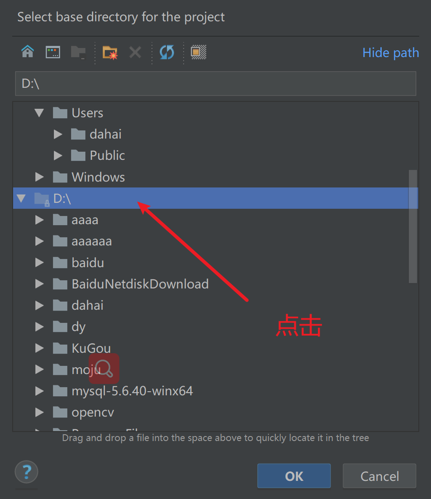

## 一.pycharm安装

## 安装包下载

可以去官网，当然老师也下载好了

### 官网下载

https://www.jetbrains.com/pycharm/

### 点击其他版本

### 下载2018.1.3

这个是和老师上课的一个版本（只是一个pycharm编辑器）

### 下载专业版2018.1.3

### 1.双击软件

### 2.可以选择自己想要安装到的目录

### 3.选择64位（看你电脑多少位）

### 4.点击install

## 二.打开pycharm

### 1.点击图标

### 2.点击ok

### 3.点击免费30天

### 4.Accept

### 5.选择主题

## 6.创建项目

#### 7.代码位置

#### 8.选择D盘

#### 9.点击新建文件夹

#### 10.输入文件夹名字点击ok创建

#### 11.选择创建好的文件夹

### 12.选择python解释器，也就是开始安装的python软件

#### 13.选择现有的解释器

#### 14.找到自己开始安装的python.exe路径

#### 15.选择系统的解释器（我们的python就是安装在windows系统上的）

#### 16.找到python安装的python.exe文件

##### 17.就是开始安装python的这个路径下

###### 18.就是这个python.exe文件导入pycharm

#### 19.点击ok

#### 20.点击创建项目

## 三.pycharm创建python文件

### 1.点击鼠标右键

### 2.new==>python file

### 3.新建python文件名

### 4.输入print('hello world')

#### 注意

靠左边，符号英文

### 5.运行代码

#### 运行结果

#### 故意写错

## 四.pycharm字体鼠标滚轮放大和缩小

### 1.file==>>settings

### 2.keymap=>>输入inc搜索

### 3.添加鼠标向上滚轮放大字体

### 4.添加鼠标向下滚轮缩小字体输入dec搜索

