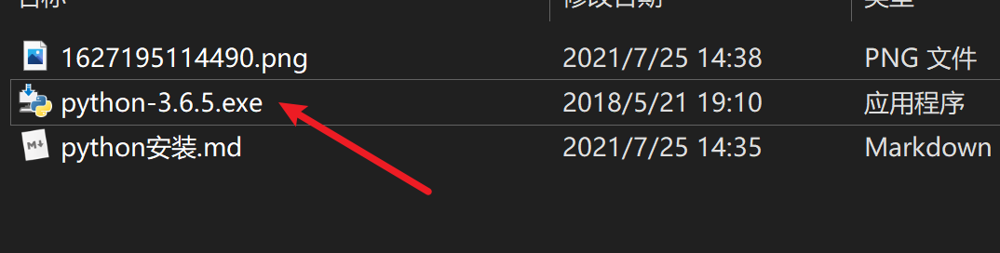
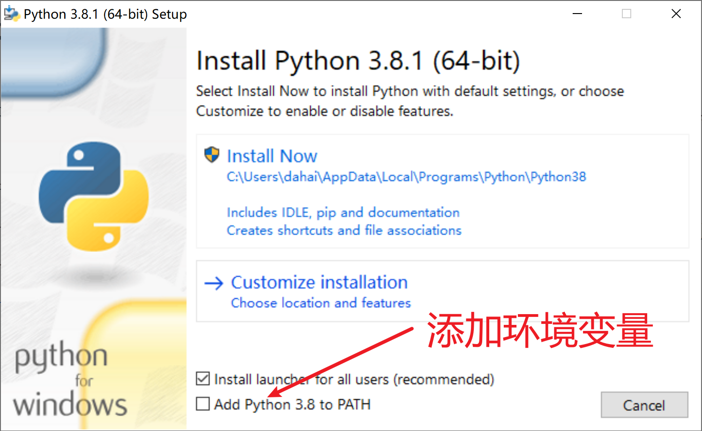
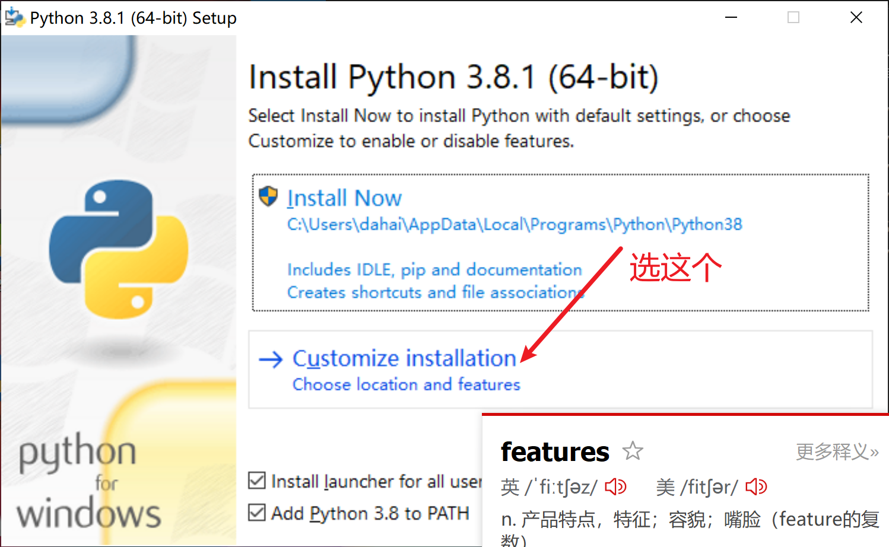
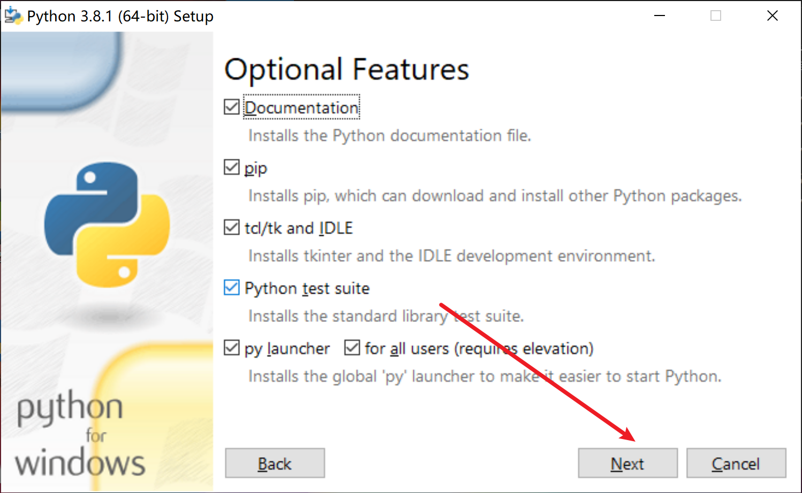
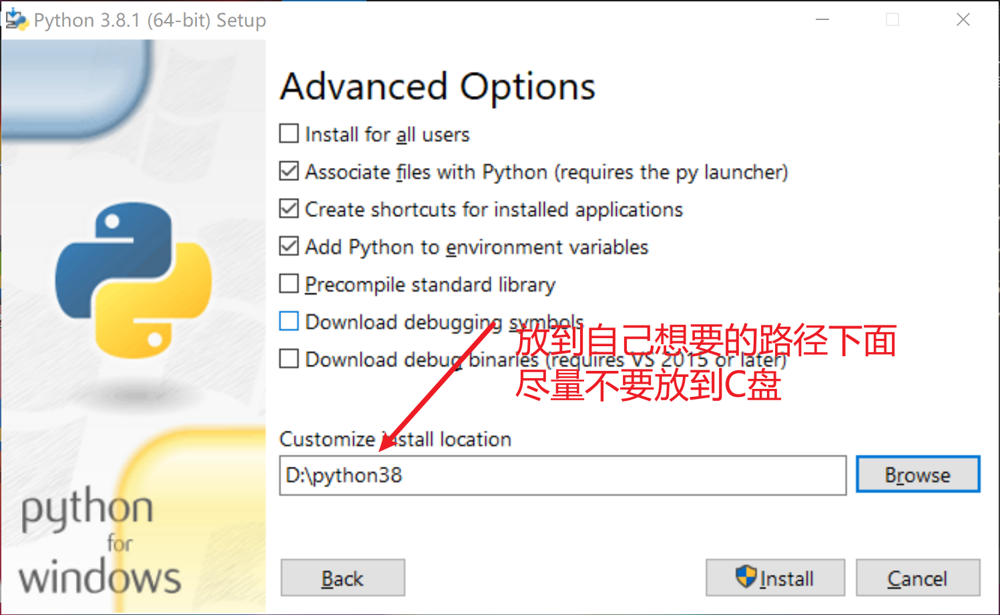
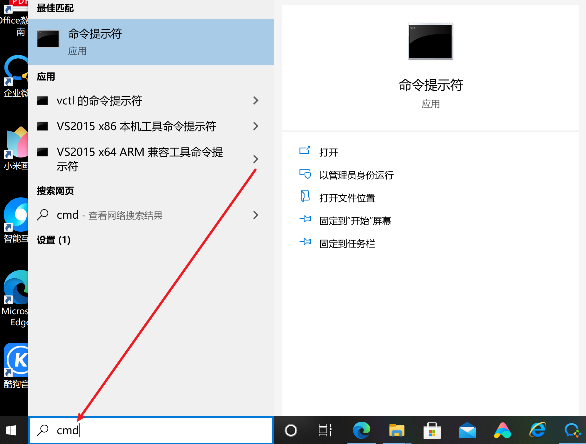
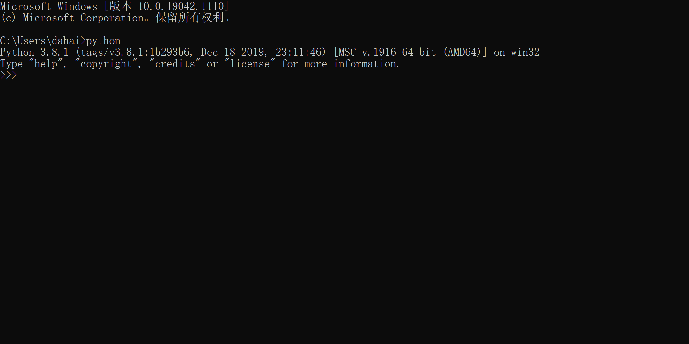
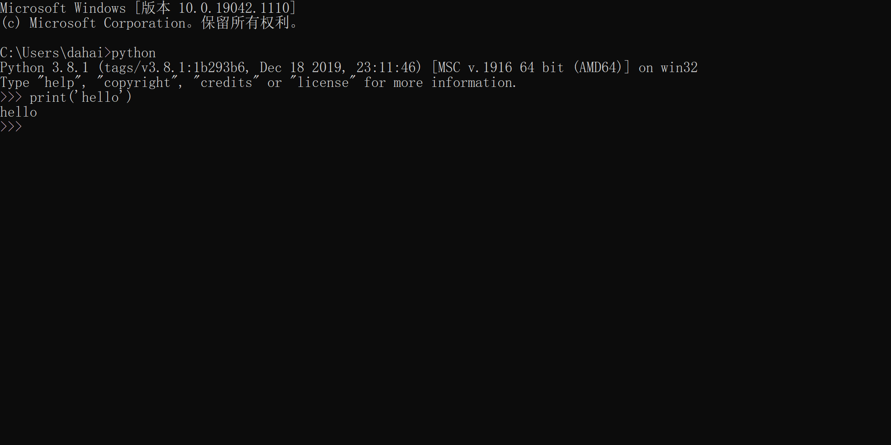

## python安装

### 第一种方式

#### 进入python官网

https://www.python.org/downloads/windows/



#### 由于老师的电脑安装了3.6，老师下面安装的是3.8，安装步骤都一样

#### 1.选择添加环境变量



#### 2.选择自定义安装路径位置



#### 3.下一步



#### 4.安装到自定义路径下



##### 5.完成


### 测试

#### 1.进入cmd



#### 2.输入python



#### 3.用python执行代码

输入print('hello world') 注意括号和引号一定要在英文输入法下输入

```python
print('hello world')
```

回车执行



